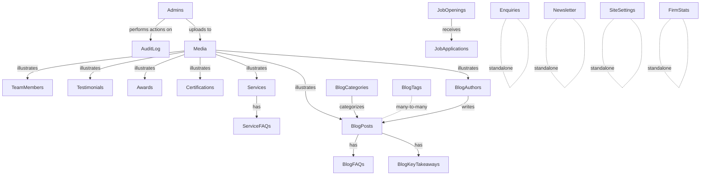

# Complete Admin Panel Planning
## Singh Amit & Associates — Screen-by-Screen & Module-by-Module Specification

| | |
|---|---|
| **Document Version** | 1.0 |
| **Depends on** | Document 1 (SRS), Document 4 (Database Design), Document 5 (API Specification) |
| **Status of underlying data** | All modules below map to **live, migrated MySQL tables** (Document 4) except where explicitly flagged as a schema gap. |

---

## 0. Global Admin Panel Conventions

These conventions apply to **every module** below. Each module's own section only calls out what differs from this baseline, to avoid restating identical UI mechanics 30+ times — the same DRY principle the audit itself recommends applying to the public site's duplicated service-page components (audit Part 3).

### 0.1 Application Shell
- **Sidebar** (collapsible, icon+label): grouped into *Overview* (Dashboard), *Content* (Blog, Services, Team, Testimonials, Awards, Certifications, Media), *Recruitment* (Job Openings, Applications), *Leads* (Enquiries, Newsletter), *Site* (Settings, Navigation, Footer, Social Links, Hero/Page Content, SEO), *System* (Users, Roles, Audit Log, Security, Backup, Database Utilities, Analytics, Reports), *Account* (Profile).
- **Topbar**: current admin's name/avatar with a dropdown (Profile, Logout), global search (jumps to a matching enquiry/post/application by keyword — future enhancement, not launch-blocking), notification bell (see §0.7).
- **Breadcrumb** trail under the topbar on every screen (reuses the same pattern already proven on the public site's Hero components, per the audit's Part 3 component inventory).
- Sidebar items are rendered conditionally per the logged-in admin's role (a `PermissionWrapper` component, see Document 6) — an `editor` never sees Users, Roles, Settings, Security, Backup, Database Utilities, or Audit Log entries in the sidebar at all, not merely disabled.

### 0.2 Data Table Convention
Every list screen (Blog Posts, Enquiries, Applications, Team, etc.) is a **Data Table** (Document 6 component) with:
- **Search**: single free-text box, server-side (`?q=`), debounced 300ms.
- **Filters**: module-specific dropdown(s) (status, category, date range) — always combinable with search.
- **Sorting**: clickable column headers, server-side (`?sort=field:asc|desc`), default sort noted per module.
- **Pagination**: server-side, 20/page default, page-size selector (20/50/100), matches the API envelope `{items, total, page, pageSize}` (Document 5 §4.1).
- **Bulk actions**: a checkbox column enabling multi-select bulk status-change/delete where the module's permission matrix (Document 7) allows it.
- **Row actions**: an overflow (⋯) menu — View, Edit, Delete/Archive, plus module-specific actions (Publish, Feature, Download).

### 0.3 Form Convention
- Two-column responsive layout on desktop, single column on mobile/tablet.
- Client-side validation (React Hook Form, mirroring the public site's existing pattern) **mirrored exactly server-side** — the audit's own Part 11 Security Review explicitly warns that 100% client-only validation is trivially bypassed; every Admin Panel form obeys the rule that client validation is a UX courtesy only (see Document 8, Validation Specification, for the authoritative field-by-field rules).
- Unsaved-changes guard: navigating away with a dirty form triggers a confirmation dialog.
- Every Create/Edit form ends in a sticky action bar: **Cancel**, **Save Draft** (content modules only), **Save & Publish** / **Save**.

### 0.4 Standard States (apply to every list/detail screen)
| State | Behavior |
|---|---|
| **Loading** | Skeleton rows matching the Data Table's column layout (Document 6, Skeleton component) — never a blocking full-page spinner for list screens. |
| **Empty** | Centered illustration + message specific to the module (e.g., "No enquiries yet — submissions from the Contact page will appear here.") + a primary action where creation is possible (e.g., "+ Add Team Member"). |
| **Error** | Inline error panel with a **Retry** button; network/5xx errors never silently fail. Field-level 422 errors render under their respective form fields (Document 8). |

### 0.5 Messaging Convention
- **Success**: green toast, auto-dismiss 4s, e.g. "Blog post published." (Document 6, Toast component).
- **Failure**: red toast for request-level failures (e.g., "Could not save — please try again."); field-level failures render inline, not as a toast.
- Destructive actions (Delete, permanent-remove) always confirm via a **Confirmation/Delete Dialog** (Document 6) stating exactly what will be affected (e.g., "This will permanently delete this job application and its résumé file. This cannot be undone.").

### 0.6 Audit Logging Convention
Every Create/Update/Delete/Publish/Status-change action in every module writes one row to `audit_logs` (Document 4 §2.3) via a shared backend service-layer call — never left to individual route handlers to remember, so coverage is uniform rather than accidental.

### 0.7 Notifications Convention
An in-app notification bell surfaces: new enquiries, new job applications, and (future) newsletter milestones. Backed by querying recent `enquiries`/`job_applications` rows created after the admin's `last_login_at` — **no dedicated `notifications` table exists or is required at this scale**; a real-time push mechanism (WebSocket) is explicitly not committed scope (SRS assumes low concurrent usage, §6.1).

### 0.8 Export / Import Convention
- **Export**: CSV, streamed, respects the current list's active filters — offered on every module with tabular business data (Enquiries, Applications, Newsletter Subscribers, Audit Log). Not offered on purely editorial content modules (Blog, Team, Testimonials) where export has no clear business use case — flagged "Not Applicable" rather than added speculatively.
- **Import**: **Not implemented for any module at launch.** The audit's roadmap describes only a one-off developer-run seed script (`scripts/seed_data.py`) for the initial 28 blog posts, not an ongoing admin-facing bulk-import feature. Listed per-module below as "Not Applicable — no bulk-import requirement identified"; a candidate future enhancement only if the firm's content volume later justifies it (Document 1 §14).

---

## 1. Dashboard

| | |
|---|---|
| **Purpose** | Single-glance operational overview for any logged-in admin/editor. |
| **Description** | Landing screen after login. Surfaces what needs attention today. |
| **Business Logic** | Aggregates counts from `enquiries` (status=`new`), `job_applications` (status=`new`), `blog_posts` (status=`published`), `job_openings` (status=`is_active`), `newsletter_subscribers` (status=`subscribed`) via `GET /api/admin/dashboard/summary` (Document 5 §4.10). |
| **Screen Layout** | Top row: 5 **Statistic Cards** (New Enquiries, New Applications, Published Posts, Active Openings, Subscribers). Below: two columns — "Recent Enquiries" (last 5, link to full list) and "Recent Applications" (last 5); a third panel "Recent Activity" from `audit_logs` (last 20 entries, admin name + action + entity + relative time). |
| **Components** | Statistic Cards (Document 6); two compact Data Tables (no pagination, "View all →" link instead); Activity Timeline (Document 6, Timeline component). |
| **Filters / Search / Sorting / Pagination** | None on this screen — it is a fixed-window summary, not a browsable list. |
| **Buttons / Actions** | Each stat card is clickable, deep-linking to its module pre-filtered (e.g., clicking "New Enquiries" opens Enquiries filtered to `status=new`). |
| **Forms / Fields / Validation** | None — read-only screen. |
| **Modals / Drawer** | None. |
| **Workflow** | Login → Dashboard (default landing route) → drill into any module. |
| **Empty / Loading / Error** | Per §0.4; empty state per card reads e.g. "No new enquiries." rather than a blank number. |
| **Permission Required** | `editor` or `admin` (both see the same dashboard; no admin-only widgets here — Users/Security summaries are deliberately excluded from this screen and live only in their own System-section screens, keeping the dashboard role-agnostic). |
| **Success / Failure Messages** | N/A (read-only); failed aggregate fetch shows the standard error state per card independently (a failure in one card must not blank the other four). |
| **Audit Logging** | None generated by viewing the dashboard. |
| **Notifications** | Dashboard is itself the primary surface for the bell's underlying data (§0.7). |
| **Export / Import** | Not Applicable. |
| **Relationships** | Reads across `enquiries`, `job_applications`, `blog_posts`, `job_openings`, `newsletter_subscribers`, `audit_logs` — no writes. |
| **Future Scalability** | A date-range selector and trend sparklines (this-week vs last-week) are natural additions once volume justifies it; not committed launch scope. |

---

## 2. Authentication (Login / Session)

| | |
|---|---|
| **Purpose** | Gate the entire Admin Panel behind verified credentials. |
| **Description** | A single public screen (`/admin/login`) outside the authenticated shell; everything else under `/admin/*` requires a valid session. |
| **Business Logic** | Per SRS FR-01–FR-05 and Document 5 §3: email+password → argon2id verify → JWT access token (≤15 min) + httpOnly refresh cookie (rotated). Silent refresh runs in the background before access-token expiry so an active admin is never abruptly logged out mid-task. |
| **Screen Layout** | Centered card: firm logo, Email field, Password field (show/hide toggle), "Log In" button, generic failure message area. No "Forgot password" self-service at launch (see Workflow) — password resets are admin-initiated via §9 Admin Users, consistent with the invite/reset-only design in Document 5 §4.9. |
| **Components** | Standard Input × 2 (Document 6), primary Button, inline error banner. |
| **Filters / Search / Sorting / Pagination** | Not Applicable. |
| **Buttons / Actions** | Log In (submit); no "Remember me" (session lifetime is governed server-side by `JWT_REFRESH_DAYS`, not a client toggle). |
| **Forms / Fields / Validation** | `email` (required, valid email format), `password` (required, non-empty client-side; the server never reveals whether the email or password was the wrong part of an invalid attempt — a single generic "Invalid email or password" message for both, to avoid user-enumeration). |
| **Modals / Drawer** | None. |
| **Workflow** | Visit `/admin/*` unauthenticated → redirected to `/admin/login` → submit → on success, redirected to originally-requested URL (or Dashboard) → session persists via silent refresh until explicit Logout or refresh-token expiry/revocation. |
| **Empty / Loading / Error** | Loading: button shows an inline spinner, disabled during submit. Error: inline banner "Invalid email or password." (401) or "Too many attempts — try again in a few minutes." (429, per the 5-attempts/15-min limiter in Document 5 §3). |
| **Permission Required** | None to view the login screen itself (it is, definitionally, the one unauthenticated Admin Panel route). |
| **Success / Failure Messages** | Success: no toast, immediate redirect. Failure: as above. |
| **Audit Logging** | `action=login` and `action=login_failed` (the latter without a resolvable `admin_id` when the email doesn't match any account, for security-monitoring visibility). |
| **Notifications** | None. |
| **Export / Import** | Not Applicable. |
| **Relationships** | Writes to `refresh_tokens` (Document 4 §2.2) on success; reads `admins`. |
| **Future Scalability** | Two-factor authentication and SSO are explicitly deferred (SRS §14 Future Enhancements, Assumption A-02). |

---

## 3. Profile (My Account)

| | |
|---|---|
| **Purpose** | Let any logged-in admin manage their own account details. |
| **Description** | Reached via the topbar avatar menu. |
| **Business Logic** | Self-service subset of `admins`: name and password change only; **role and `is_active` are never self-editable** (only another `admin` via §9 can change those — prevents privilege self-escalation). |
| **Screen Layout** | Single card: Name field, read-only Email (email changes require an `admin` via §9, since email is also the login identifier and unique-constrained), "Change Password" sub-section (current password, new password, confirm). |
| **Components** | Standard Input, Password Input with strength indicator (Document 6). |
| **Filters / Search / Sorting / Pagination** | Not Applicable. |
| **Buttons / Actions** | Save Changes; Change Password (separate submit from name change, so a name edit never requires re-entering a password). |
| **Forms / Fields / Validation** | `name` required. New password: minimum 12 characters, must differ from current (server checks this — see Document 8); current password required to authorize the change. |
| **Modals / Drawer** | None. |
| **Workflow** | Profile → edit → save → success toast; password change **immediately revokes all other active `refresh_tokens` for this admin** (forces re-login on other devices) — a deliberate security behavior, not a bug, disclosed to the user via the success toast copy ("Password updated. You've been logged out of other devices."). |
| **Empty / Loading / Error** | Standard per §0.4. |
| **Permission Required** | Any authenticated admin (self only — enforced server-side by deriving the target id from the JWT, never from a client-supplied id). |
| **Success / Failure Messages** | "Profile updated." / "Password updated. You've been logged out of other devices." / "Current password is incorrect." |
| **Audit Logging** | `action=update_profile`, `action=change_password` (the latter never logs the password itself, only the event). |
| **Notifications** | None. |
| **Export / Import** | Not Applicable. |
| **Relationships** | `admins` (self row only); cascades a `refresh_tokens` revoke on password change. |
| **Future Scalability** | Avatar/photo upload (via Media Library, §17) is a natural low-effort addition, not committed at launch since `admins` has no `avatar_media_id` column today (would require a small follow-up migration). |

---

## 4. Users (Admin User Management)

| | |
|---|---|
| **Purpose** | `admin`-role staff manage who has Admin Panel access and at what role. |
| **Description** | Full CRUD screen over the `admins` table (Document 5 §4.9). |
| **Business Logic** | Invite-based creation (no plaintext password ever transits the API — see §0's forms and Document 5 §4.9); an admin cannot delete/deactivate themself (Document 1 Business Rule #6, enforced both client-side — disabling the action on one's own row — and server-side — a 422 if attempted directly against the API). |
| **Screen Layout** | Data Table: Name, Email, Role (badge), Status (Active/Inactive badge), Last Login, row actions. |
| **Components** | Data Table (§0.2); Status Badge (Document 6); "+ Invite User" primary button opening a Drawer (Document 6) rather than a full page, since the form is short. |
| **Filters / Search / Sorting / Pagination** | Filter by Role, filter by Status; search by name/email; sort by Last Login (default) or Name; standard pagination (§0.2). |
| **Buttons / Actions** | Invite User; per-row: Edit (role/status), Reset Password (triggers reset email, does not open a password field), Deactivate/Reactivate, Delete (only if the account has never logged in — otherwise Deactivate is enforced instead, to preserve `audit_logs.admin_id` referential meaning per Document 4 §2.3's SET NULL design). |
| **Forms / Fields / Validation** | Invite: `name` (required), `email` (required, valid, unique — 422 "This email is already in use." on conflict), `role` (`admin`/`editor`, required). Edit: `role`, `isActive` only. |
| **Modals / Drawer** | Invite/Edit in a Drawer; Delete/Deactivate/Reset-Password each behind a Confirmation Dialog (§0.5) with role-specific wording. |
| **Workflow** | Invite → system emails a one-time setup link → invitee sets their own password (never chosen by the inviting admin) → account becomes usable. |
| **Empty / Loading / Error** | Empty: "No team members yet — invite your first admin user." (never truly empty in practice since at least one seeded admin must exist to reach this screen at all). |
| **Permission Required** | **`admin` only** — entirely hidden from `editor` role, per §0.1. |
| **Success / Failure Messages** | "Invitation sent." / "User updated." / "Password reset email sent." / "You can't remove your own account." (attempted self-delete). |
| **Audit Logging** | `action=create_admin`, `update_admin`, `deactivate_admin`, `delete_admin`, `reset_password_requested`. |
| **Notifications** | None beyond the invite/reset emails themselves (via the existing Resend/SMTP `email_service.py`). |
| **Export / Import** | Not Applicable (small, sensitive list; no business need identified). |
| **Relationships** | `admins`; deleting/deactivating cascades no data loss elsewhere (`audit_logs.admin_id` and `media.uploaded_by` are both `SET NULL`, per Document 4). |
| **Future Scalability** | If the firm grows beyond ~10 staff, a department/team grouping could be added — not needed today. |

---

## 5. Roles & Permissions

| | |
|---|---|
| **Purpose** | Give `admin` users visibility into what each role can do — **not** a dynamic role-builder. |
| **Description** | A deliberately simple, read-only reference screen, not a configurable RBAC engine. |
| **Business Logic** | The system ships exactly two fixed roles (`admin`, `editor`), matching the `admins.role` ENUM (Document 4 §2.1) and the audit's explicit Part 8 recommendation that "two roles is enough for this site's scale" rather than a full RBAC engine, which would be over-engineering relative to a single-firm, small-staff deployment. |
| **Screen Layout** | Two side-by-side cards ("Admin", "Editor"), each listing its permitted modules/actions, sourced directly from Document 7 (Permission Matrix) so the UI and the documentation never drift apart. |
| **Components** | Static permission-matrix table (read-only rendering of Document 7). |
| **Filters / Search / Sorting / Pagination** | Not Applicable. |
| **Buttons / Actions** | None — no "Create Role" button exists; this is intentional, not a missing feature. |
| **Forms / Fields / Validation** | Not Applicable. |
| **Modals / Drawer** | None. |
| **Workflow** | View-only reference, typically reached from Users (§4) when deciding what role to assign an invitee. |
| **Empty / Loading / Error** | Not Applicable (static content, no failure mode beyond the page failing to load like any other route). |
| **Permission Required** | **`admin` only**. |
| **Success / Failure Messages** | Not Applicable. |
| **Audit Logging** | None (no mutations occur here). |
| **Notifications** | None. |
| **Export / Import** | Not Applicable. |
| **Relationships** | None (no dedicated `roles`/`permissions` tables exist or are proposed — see Document 4, which deliberately does not add them, consistent with avoiding unnecessary schema complexity). |
| **Future Scalability** | If the firm's needs later require granular, per-module custom roles, this becomes a genuine RBAC redesign (new `roles`/`permissions`/`role_permissions` tables) — explicitly out of scope today and flagged in Document 1 §14 rather than half-built now. |

---

## 6. Blog (Posts)

| | |
|---|---|
| **Purpose** | Central content-marketing engine — replaces the current developer-only edit path for `frontend/src/data/blog/posts.js`. |
| **Description** | Full CRUD over `blog_posts` and its children (`blog_faqs`, `blog_key_takeaways`, `blog_post_tags`), per Document 4 §2.20–2.23 and Document 5 §4.4. |
| **Business Logic** | Draft → Published → Archived lifecycle (`status` enum). Publishing sets `published_at` server-side. Slug is auto-generated from title on create (editable before first publish, warned-but-allowed after — Document 1 Business Rule #2). Reading time is auto-calculated server-side from word count (not admin-entered) for consistency. |
| **Screen Layout** | List: Data Table with Title, Category, Author, Status badge, Published Date, Views. Edit screen: two-column — left (70%) Title/Slug/Excerpt/Rich Text Editor body/Key Takeaways repeater/FAQs repeater; right (30%) sidebar card with Status, Category picker, Author picker, Tags multi-select, Featured Image (Media Picker), SEO fields (Meta Title/Description with live character-count against the 220/320 DB limits from Document 4). |
| **Components** | Data Table; Rich Text Editor (Document 6); Media Picker (Document 6); Tag/Category Select (Document 6, Autocomplete); repeatable field groups for Key Takeaways/FAQs (add/remove/reorder rows). |
| **Filters / Search / Sorting / Pagination** | Filter by Status, Category, Author; search by title (server-side, uses the new `?status=&category=&page=` admin endpoint — Document 5 §4.4, distinct from the public endpoint's current lack of filtering, flagged as a gap in Document 5 §5.1); sort by Published Date (default desc) or Title; standard pagination. |
| **Buttons / Actions** | + New Post; per-row: Edit, Preview (opens the live public URL in a new tab if published), Publish/Unpublish toggle, Duplicate (creates a new draft copy — useful for template reuse across similar service updates), Delete (only from Draft/Archived, per Document 5 §4.4's two-step guard). |
| **Forms / Fields / Validation** | Per Document 8 — title (required, ≤220 chars), slug (required, unique, URL-safe pattern), content (required, non-empty rich text), category/author (optional FK pickers), tags (0+ multi-select), meta title/description (optional, length-capped to match DB columns). |
| **Modals / Drawer** | Delete confirmation; "Change slug on a published post?" warning modal (surfaces the API's `warnings` array from Document 5 §4.4). |
| **Workflow** | Draft created → edited/previewed → Publish → optionally later Archive (removes from public listing without deleting) → Delete only after Archive/Draft. |
| **Empty / Loading / Error** | Empty: "No blog posts yet — publish your first article." Loading: skeleton table + skeleton editor on the edit route. Error: per §0.4, plus autosave-failure banner while editing (draft content is not lost — retry via the banner). |
| **Permission Required** | `editor` or `admin` — full CRUD (Document 7). |
| **Success / Failure Messages** | "Post saved as draft." / "Post published." / "Post archived." / "Couldn't save — check the highlighted fields." |
| **Audit Logging** | `create`, `update`, `delete`, `status_change` (publish/unpublish/archive) per §0.6. |
| **Notifications** | None beyond standard toasts. |
| **Export / Import** | Not Applicable per §0.8 (no bulk-export business need identified for editorial content). |
| **Relationships** | → `blog_categories`, `blog_authors` (many-to-one, nullable), `blog_tags` (many-to-many via `blog_post_tags`), `blog_faqs`/`blog_key_takeaways` (one-to-many, cascade-deleted with the post), `media` (featured image). |
| **Future Scalability** | Server-side pagination is already the target design (unlike the current public endpoint) so this scales past hundreds of posts without a redesign; a full-text search index (MySQL `FULLTEXT` on `title`+`content`) is a low-effort future add once the free-text `?q=` search matters at volume. |

---

## 7. Blog Categories

| | |
|---|---|
| **Purpose** | Manage the taxonomy used to organize blog posts. |
| **Description** | Simple CRUD over `blog_categories` (Document 4 §2.17). |
| **Business Logic** | `name`/`slug` unique; delete blocked (409) while any `blog_posts.category_id` references the category (Document 5 §4.1) — admin must first recategorize or archive affected posts. |
| **Screen Layout** | Compact Data Table (Name, Slug, Post Count, Actions) — typically rendered as a single page, not paginated, given the audit's observed 10-category scale. |
| **Components** | Data Table; inline-edit or Drawer form (Name, Slug auto-from-name, Description). |
| **Filters / Search / Sorting / Pagination** | Search by name; sort alphabetical (default); pagination present but rarely needed at this scale. |
| **Buttons / Actions** | + New Category; Edit; Delete (disabled/tooltip-explained when Post Count > 0). |
| **Forms / Fields / Validation** | `name` required, unique; `slug` required, unique, URL-safe; `description` optional. |
| **Modals / Drawer** | Create/Edit in a Drawer; Delete confirmation. |
| **Workflow** | Create category → available immediately in the Blog Post category picker (§6). |
| **Empty / Loading / Error** | Empty: "No categories yet." Standard loading/error otherwise. |
| **Permission Required** | `editor` or `admin`. |
| **Success / Failure Messages** | "Category created." / "Can't delete — 4 posts still use this category." |
| **Audit Logging** | `create`, `update`, `delete`. |
| **Notifications** | None. |
| **Export / Import** | Not Applicable. |
| **Relationships** | One-to-many with `blog_posts` (SET NULL on delete at the DB level; blocked at the API level while in use, per Document 4 §2.17 and Document 5 §4.1). |
| **Future Scalability** | None needed; taxonomy tables stay small by nature. |

---

## 8. Blog Tags

Identical structure to §7 (Blog Categories), applied to `blog_tags` (Document 4 §2.18) — many-to-many with posts via `blog_post_tags` rather than one-to-many. Delete is blocked (409) while any post still carries the tag. No `description` field exists on `blog_tags` (Document 4 confirms this column is absent by design — tags are lighter-weight than categories). Permission, messaging, audit, and export/import behavior are otherwise identical to §7.

---

## 9. Blog Authors

| | |
|---|---|
| **Purpose** | Manage blog post bylines (distinct from Team Members, §14 — an author is a writing credit, not necessarily a public-facing team bio, though in practice they often overlap). |
| **Description** | CRUD over `blog_authors` (Document 4 §2.19). |
| **Business Logic** | `slug` unique; delete blocked (409) while referenced by any `blog_posts.author_id`. |
| **Screen Layout** | Data Table (Avatar, Name, Designation, Post Count, Actions). |
| **Components** | Data Table; Drawer form with Media Picker for avatar. |
| **Filters / Search / Sorting / Pagination** | Search by name; standard pagination. |
| **Buttons / Actions** | + New Author; Edit; Delete (guarded as above). |
| **Forms / Fields / Validation** | `name` required; `slug` required/unique; `designation`, `bio` optional; `avatarMediaId` optional (Media Picker). |
| **Modals / Drawer** | Drawer for create/edit; Delete confirmation. |
| **Workflow** | Create author → selectable in Blog Post editor (§6). |
| **Empty / Loading / Error** | Standard per §0.4. |
| **Permission Required** | `editor` or `admin`. |
| **Success / Failure Messages** | "Author saved." / "Can't delete — used by 6 posts." |
| **Audit Logging** | `create`, `update`, `delete`. |
| **Notifications** | None. |
| **Export / Import** | Not Applicable. |
| **Relationships** | One-to-many with `blog_posts`; many-to-one with `media` (avatar). |
| **Future Scalability** | None needed at current scale. |

---

## 10. Testimonials

| | |
|---|---|
| **Purpose** | Manage client testimonials shown on the homepage and elsewhere. |
| **Description** | CRUD over `testimonials` (Document 4 §2.16). |
| **Business Logic** | `rating` constrained 1–5 at the DB level (`ck_testimonial_rating_range`) — the form must enforce the same range client-side and the server re-validates it regardless (Document 8). `is_featured` controls homepage carousel inclusion; `is_active` is the soft-delete/publish toggle. |
| **Screen Layout** | Data Table (Client Name, Company, Rating (stars), Featured (badge), Active (badge), Actions). |
| **Components** | Data Table; Drawer form (Client Name, Designation, Company, Content textarea, Rating (star picker), Photo via Media Picker, Featured toggle). |
| **Filters / Search / Sorting / Pagination** | Filter by Featured/Active; search by client name; sort by `sort_order` (drag-to-reorder, per audit's `display_order` convention) or Created Date; standard pagination. |
| **Buttons / Actions** | + New Testimonial; Edit; Feature/Unfeature (quick toggle, `PATCH .../feature` per Document 5 §4.2); Activate/Deactivate; Delete. |
| **Forms / Fields / Validation** | `clientName` required; `content` required; `rating` optional but if present 1–5; others optional. |
| **Modals / Drawer** | Drawer for create/edit; Delete confirmation. |
| **Workflow** | Create → toggle Featured for homepage inclusion → reorder via drag handle to control display sequence. |
| **Empty / Loading / Error** | Empty: "No testimonials yet." Standard otherwise. |
| **Permission Required** | `editor` or `admin`, full CRUD. |
| **Success / Failure Messages** | "Testimonial saved." / "Testimonial removed." |
| **Audit Logging** | `create`, `update`, `delete`, `feature_toggle`. |
| **Notifications** | None. |
| **Export / Import** | Not Applicable. |
| **Relationships** | Many-to-one with `media` (photo). |
| **Future Scalability** | None needed; naturally small dataset. |

---

## 11. Services

| | |
|---|---|
| **Purpose** | Manage the firm's core service-line metadata (GST, Income Tax, TDS, Accounting & Bookkeeping today; extensible to more). |
| **Description** | CRUD over `services` (Document 4 §2.13). **Important scope boundary**: this module manages only the editable *metadata* (name, description, icon, image) — it does **not** manage the bespoke, section-by-section page content (Compliance Matters, Filing Calendar, Industries grids, etc.) that the audit found hard-coded per service page. Modeling those fully is future work (see §12 below and SRS §14), not committed Admin Panel launch scope. |
| **Business Logic** | `slug` unique and must match the live route (`gst-services`, etc.) — changing it would break the public route unless the frontend route itself is also updated, so the Admin Panel warns (not blocks) on slug edits to existing services, mirroring the Blog Post slug-change warning pattern (§6). |
| **Screen Layout** | Data Table (Name, Slug, Active badge, FAQ Count, Actions); Edit screen with Name/Slug/Short & Full Description/Icon picker/Featured Image (Media Picker), plus an embedded **Service FAQs** sub-panel (see §13). |
| **Components** | Data Table; form; nested repeater for FAQs (or a link to the dedicated §13 screen — either pattern is acceptable, recommend embedding for editorial convenience since FAQs are always edited in the context of their parent service). |
| **Filters / Search / Sorting / Pagination** | Search by name; filter Active/Inactive; standard pagination (though the audit's current count is 4, so pagination is rarely exercised in practice). |
| **Buttons / Actions** | + New Service (rare — the firm's service lines change infrequently); Edit; Activate/Deactivate; no Delete recommended by default (services are foundational content — Document 7 defines Delete as `admin`-only, requiring explicit elevated confirmation, rather than available to `editor`). |
| **Forms / Fields / Validation** | `name` required; `slug` required/unique/URL-safe; descriptions optional but length-capped; `icon` from a constrained icon-name list (matches the public site's Feather-icon convention per the audit's Design Language findings). |
| **Modals / Drawer** | Slug-change warning modal; Delete confirmation (admin-only). |
| **Workflow** | Edit existing service metadata → changes reflect on the corresponding live service page immediately (no redeploy) — this alone resolves the audit's core finding that service content today requires a code change. |
| **Empty / Loading / Error** | Standard per §0.4 (empty state realistically never hit post-seed). |
| **Permission Required** | `editor` or `admin` for Read/Create/Update; **`admin` only** for Delete (Document 7). |
| **Success / Failure Messages** | "Service updated." / "Changing this slug may break the live service page URL — continue?" |
| **Audit Logging** | `create`, `update`, `delete`, `activate`/`deactivate`. |
| **Notifications** | None. |
| **Export / Import** | Not Applicable. |
| **Relationships** | One-to-many with `service_faqs` (cascade delete); many-to-one with `media` (featured image). |
| **Future Scalability** | If the firm's service catalogue grows well beyond four lines, or if the bespoke per-page sections (§12) are later modeled, this screen's "Full Description" single field would evolve into a structured section-builder — explicitly deferred, not built speculatively now. |

---

## 12. Service Sections — **SCHEMA GAP, FLAGGED PER "NEVER MAKE ASSUMPTIONS"**

| | |
|---|---|
| **Purpose (as requested)** | Manage the granular, section-by-section content blocks (Compliance Matters, Filing Calendar, ITC, Industries, Working Process, etc.) that the audit found hard-coded as independent React component trees on each of the four service pages. |
| **Current reality** | **No table for this exists in the live schema** (Document 4 confirms `services`/`service_faqs` are the only service-related tables). Modeling this properly would require either (a) a flexible `service_sections` table (`service_id` FK, `section_type` enum, `sort_order`, a JSON `content` column) generic enough to represent GST's `FilingCalendar` and TDS's `FormsReconciliation` differently, or (b) accepting that these sections remain code-defined and only their *text content* becomes editable via a simpler key-value pattern similar to `site_settings`. |
| **Recommendation** | **This module is out of committed Admin Panel scope** (confirmed by SRS §3 Out of Scope, which explicitly excludes "real interactive tools" and bespoke per-page section modeling as a future initiative, not a launch requirement). Documented here, per instructions not to skip any requested module, specifically to make the gap explicit rather than silently implying it's handled. |
| **Screen Layout / Components / Forms / etc.** | Not designed — would require a dedicated schema and UX design pass as a separate future engagement once/if the firm confirms this is worth the added complexity versus the four service pages' current (working, if duplicated) hard-coded state. |
| **Permission Required** | Not Applicable (not built). |
| **Future Scalability** | This is the natural companion to the audit's Part 3 recommendation to consolidate the four duplicated service-page component trees into shared `ServiceHero`/`ServiceSidebar`/etc. components — doing the frontend consolidation first would make a future `service_sections` schema meaningfully easier to design well, since the shared components would define a much smaller, cleaner content contract to fill from the database. |

---

## 13. Service FAQs

| | |
|---|---|
| **Purpose** | Manage the FAQ accordion content on each service page. |
| **Description** | CRUD over `service_faqs` (Document 4 §2.14), embedded within the Service edit screen (§11) as the primary UX, with row-level add/edit/delete/reorder. |
| **Business Logic** | `sort_order` controls accordion display sequence; cascade-deleted automatically if the parent service is deleted (DB-level `ON DELETE CASCADE`). |
| **Screen Layout** | Repeater list within §11's edit screen: Question (text), Answer (textarea), drag handle for reordering, delete icon per row, "+ Add FAQ" row. |
| **Components** | Repeater field group (Document 6). |
| **Filters / Search / Sorting / Pagination** | Not Applicable (always shown in full within its parent service, typically <10 rows). |
| **Buttons / Actions** | Add FAQ row; delete row (with inline confirm, not a full modal, since it's a sub-item of an already-open form). |
| **Forms / Fields / Validation** | `question` required ≤300 chars; `answer` required. |
| **Modals / Drawer** | None — inline within the parent form. |
| **Workflow** | Edited and saved together with the parent Service record (a single `PUT /api/admin/services/{id}/faqs` replaces the full set, per Document 5 §4.2). |
| **Empty / Loading / Error** | Empty: "No FAQs yet for this service." |
| **Permission Required** | Same as §11 (`editor`/`admin` for edit). |
| **Success / Failure Messages** | Bundled with the parent Service save message. |
| **Audit Logging** | Captured as part of the parent service's `update` audit entry (`details` diff includes the FAQ set change). |
| **Notifications** | None. |
| **Export / Import** | Not Applicable. |
| **Relationships** | Many-to-one with `services` (CASCADE delete). |
| **Future Scalability** | None needed. |

---

## 14. Team Members

| | |
|---|---|
| **Purpose** | Manage partner/staff bios on the About page. |
| **Description** | CRUD over `team_members` (Document 4 §2.15). |
| **Business Logic** | Soft-delete only (`is_active=false`) when a partner leaves, per Document 4's migration notes — preserves historical integrity rather than a hard delete. |
| **Screen Layout** | Data Table (Photo thumbnail, Name, Designation, Active badge, Actions). |
| **Components** | Data Table; Drawer/page form (Name, Slug, Designation, Bio rich text or plain textarea, Qualifications (tag input, comma-stored per Document 4's schema), Photo via Media Picker, Email, LinkedIn URL). |
| **Filters / Search / Sorting / Pagination** | Search by name; filter Active/Inactive; sort by `sort_order` (drag-reorder) or Name; standard pagination. |
| **Buttons / Actions** | + New Team Member; Edit; Activate/Deactivate; Delete (`admin` only, per Document 7, given the sensitivity of removing a public bio entirely vs. deactivating). |
| **Forms / Fields / Validation** | `name` required; `slug` required/unique; `email` optional but valid-format if present; `linkedinUrl` optional but valid-URL if present. |
| **Modals / Drawer** | Create/Edit drawer; Delete confirmation. |
| **Workflow** | Add new partner → immediately visible on `/about` (no redeploy) — directly resolves the audit's finding that team bios currently require a code change. |
| **Empty / Loading / Error** | Standard per §0.4. |
| **Permission Required** | `editor`/`admin` for CRU; `admin` only for D (Document 7). |
| **Success / Failure Messages** | "Team member saved." / "Team member deactivated." |
| **Audit Logging** | `create`, `update`, `delete`, `activate`/`deactivate`. |
| **Notifications** | None. |
| **Export / Import** | Not Applicable. |
| **Relationships** | Many-to-one with `media` (photo). |
| **Future Scalability** | The `expertise` tag array noted as a future column in Document 4 §2.15 would need a small follow-up migration before this screen could expose it — not blocking today's scope. |

---

## 15. Awards

Structurally identical to §10 (Testimonials) applied to `awards` (Document 4 §2.11): Data Table (Title, Year, Active badge, Actions), Drawer form (Title, Description, Year, Image via Media Picker), sort-order drag-reorder, soft delete via `is_active`. Search by title; filter by Year range. Permission: `editor`/`admin` full CRUD (lower sensitivity than Team/Services — no admin-only Delete restriction needed here, per Document 7). Relationships: many-to-one with `media`. No export/import. No future-scalability concerns at this content volume.

---

## 16. Certifications

Structurally identical to §15 (Awards) applied to `certifications` (Document 4 §2.12): adds an `issuingBody` field (e.g., "ICAI") not present on Awards. Same permission level, same soft-delete pattern, same Media Picker integration. No export/import.

---

## 17. Media Library

| | |
|---|---|
| **Purpose** | Central, reusable image repository backing every content module's image fields — resolving the fact that `media` exists in the schema but is currently write-empty (Document 4 §2.8). |
| **Description** | Grid-based browser + uploader, invoked either as its own sidebar screen or as the embedded **Media Picker** component (Document 6) inside every other module's forms. |
| **Business Logic** | Upload → server content-sniffs MIME (extending the pattern already proven for résumés, per Document 5 §4.3) → stored with a randomized filename → registered as a `media` row. Deletion is blocked (409) if any other table's `*_media_id` still references it (Document 5 §4.3), surfaced to the admin as a list of exactly which records are using it. |
| **Screen Layout** | Masonry/grid thumbnail view with a persistent upload dropzone at top; clicking a thumbnail opens a side Drawer with the image preview, Alt Text field, file metadata (size, type, uploaded-by, date), "Used in: [list]," and Delete. |
| **Components** | Uploader (drag-drop + click-to-browse, Document 6); grid of Cards; Drawer detail panel; the same component doubles as a **Media Picker** modal when invoked from another form (select-existing vs. upload-new tabs). |
| **Filters / Search / Sorting / Pagination** | Search by filename/alt text; filter by file type (image/pdf if ever extended); sort by Upload Date (default) or Size; standard pagination (grid-adapted, e.g., 24/page). |
| **Buttons / Actions** | Upload; per-item: Edit Alt Text, Delete, Copy Path/URL. |
| **Forms / Fields / Validation** | Upload: file required, image-MIME-whitelisted, size-capped via `UPLOAD_MAX_MB` (Document 8). Alt Text: optional but strongly recommended — the UI nudges (not blocks) with an accessibility hint, consistent with the public site's already-good `aria-label` discipline the audit documented. |
| **Modals / Drawer** | Detail/edit Drawer; Delete confirmation (shows the blocking-reference list when applicable, per Document 5 §4.3). |
| **Workflow** | Upload once → reuse across Blog, Team, Testimonials, Awards, Certifications, Services — eliminates duplicate uploads and gives a single place to update alt text. |
| **Empty / Loading / Error** | Empty: "No media yet — upload your first image." Loading: skeleton grid tiles. Error: per §0.4, plus per-file upload-failure indicators when uploading multiple files at once. |
| **Permission Required** | `editor`/`admin` for upload/edit-alt-text/delete (Document 7). |
| **Success / Failure Messages** | "Image uploaded." / "Can't delete — used by 3 records." / "File type not supported." |
| **Audit Logging** | `create` (upload), `update` (alt text), `delete`. |
| **Notifications** | None. |
| **Export / Import** | Not Applicable (files are downloaded individually via Copy Path/direct link, not bulk-exported). |
| **Relationships** | Hub table referenced by `awards`, `certifications`, `services`, `team_members`, `testimonials`, `blog_authors`, `blog_posts` (all `ON DELETE SET NULL`, per Document 4 §2.8). |
| **Future Scalability** | `STORAGE_BACKEND` is already an env-driven seam (local disk today, S3 planned per Document 4 §2.8/Document 10) — the Admin Panel's Media Library UI must be storage-backend-agnostic so switching to S3 later requires no frontend change, only a backend config change. Image `width`/`height` columns (Document 4's noted future columns) would enable responsive `srcset` generation, tying into the audit's Performance Review recommendation. |

---

## 18. Career (Module Group Overview)

Career is implemented as two related but distinct Admin Panel screens: **Job Openings** (§19) and **Applications** (§20). This section exists per the instruction to cover "Career" explicitly; its content is the union of §19 and §20 — there is no separate top-level "Career" table or screen beyond these two, since `job_openings` and `job_applications` are already modeled as two distinct entities in Document 4 (§2.5, §2.6) with a clean one-to-many relationship between them.

---

## 19. Job Openings

| | |
|---|---|
| **Purpose** | Manage recruitment listings shown on `/career`. |
| **Description** | CRUD over `job_openings` (Document 4 §2.5). |
| **Business Logic** | Cannot be hard-deleted if any `job_applications` reference it (409, per Document 5 §4.2) — must be soft-closed via `is_active=false` instead, preserving applicant history. `closes_at`, if set and in the past, could optionally auto-hide the listing from the public `GET /api/careers/openings` — **flagged as a recommended but not yet confirmed business rule**; today the public endpoint filters only on `is_active`, not `closes_at` (verified in Document 5 §2.8) — an editor must remember to deactivate manually unless this auto-close logic is explicitly added. |
| **Screen Layout** | Data Table (Title, Department, Location, Type badge, Active badge, Application Count, Actions). |
| **Components** | Data Table; form (Title, Slug, Department, Location, Employment Type select, Description/Requirements/Responsibilities rich text or textarea, Min Experience Years, Posted/Closes dates). |
| **Filters / Search / Sorting / Pagination** | Filter by Employment Type, Active status; search by title; sort by Posted Date (default) or Application Count; standard pagination. |
| **Buttons / Actions** | + New Opening; Edit; Activate/Deactivate (Close); Delete (blocked if applications exist, per above). |
| **Forms / Fields / Validation** | `title` required; `slug` required/unique; `employmentType` required enum; `description` required; others optional (Document 8). |
| **Modals / Drawer** | Create/Edit drawer or page; Delete confirmation (or a redirect-to-Deactivate explainer if applications exist). |
| **Workflow** | Create opening → appears on `/career` immediately → applications accumulate (§20) → close/deactivate when filled. |
| **Empty / Loading / Error** | Standard per §0.4. |
| **Permission Required** | `editor`/`admin` full CRUD (Delete constrained by the referential rule above, not by role). |
| **Success / Failure Messages** | "Job opening published." / "Can't delete — 4 applications reference this opening. Close it instead." |
| **Audit Logging** | `create`, `update`, `delete`, `activate`/`deactivate`. |
| **Notifications** | None beyond dashboard counts (§1). |
| **Export / Import** | Not Applicable. |
| **Relationships** | One-to-many with `job_applications` (SET NULL on hard delete, which is itself blocked while rows exist — belt-and-suspenders consistency). |
| **Future Scalability** | None needed at current 5-listing scale; the schema already supports far more without change. |

---

## 20. Job Applications

| | |
|---|---|
| **Purpose** | Triage and manage inbound applications submitted via the live `/career` form. |
| **Description** | Read + status-management CRUD over `job_applications` (Document 4 §2.6), including secure résumé access. |
| **Business Logic** | No Create (applications only originate publicly); Update limited to `status` and `notes`-equivalent fields (the schema's `message` column is the applicant's own cover-letter text and must remain immutable — any staff annotation needs its own field, see Future Scalability below); Delete is **`admin`-only** and irreversible (removes both the DB row and the stored résumé file), per Document 5 §4.6, reflecting GDPR-style data-removal sensitivity. |
| **Screen Layout** | Data Table (Applicant Name, Position Applied For, Status badge, Applied Date, Résumé icon-link, Actions). Detail Drawer on row click: full applicant info, cover-letter/message text, Résumé "Download" (opens the signed, 15-min-TTL URL per Document 5 §4.6 — never a raw static path), Status dropdown, save. |
| **Components** | Data Table; Detail Drawer; Status Badge/Select (Document 6). |
| **Filters / Search / Sorting / Pagination** | Filter by Status, by Job Opening; search by applicant name/email; sort by Applied Date (default, newest-first); standard pagination. |
| **Buttons / Actions** | Row → open Detail Drawer; Status change (New → Reviewed → Shortlisted → Rejected/Hired); Download Résumé; Delete (admin-only, confirmation-gated). |
| **Forms / Fields / Validation** | Only `status` (enum) is admin-editable per Document 4 §2.6's `application_status` enum values. |
| **Modals / Drawer** | Detail Drawer (primary interaction surface); Delete confirmation with explicit "this also deletes the stored résumé file" wording. |
| **Workflow** | Application arrives (live today) → appears in this list as `new` → staff reviews résumé → updates status through the pipeline → optionally deletes per retention policy (Document 1 Assumption A-05 — **the firm must define a concrete retention period**; until then, deletion is manual/ad hoc only). |
| **Empty / Loading / Error** | Empty: "No applications yet — submissions from the Career page will appear here." |
| **Permission Required** | `editor`/`admin` for Read/status-Update; **`admin` only** for Delete (Document 7, Document 5 §4.6). |
| **Success / Failure Messages** | "Status updated." / "Application deleted." / "Couldn't generate résumé download link — try again." |
| **Audit Logging** | `status_change`, `delete` (the latter capturing enough `details` — applicant name/email, not the résumé content — to preserve an audit trail even after the underlying record is gone). |
| **Notifications** | Feeds the Dashboard's "New Applications" count and bell (§0.7, §1). |
| **Export / Import** | **Export**: CSV per Document 5 §4.6 pattern (applicant contact + status + position, excluding the résumé binary itself). Import: Not Applicable. |
| **Relationships** | Many-to-one with `job_openings` (nullable, SET NULL if the opening is later removed — `position_applied_for` is a denormalized snapshot precisely so this history survives, per Document 4 §2.6). |
| **Future Scalability** | A dedicated `staff_notes` text column (distinct from the applicant's own `message`) is a clear, low-risk future migration once the firm confirms it wants internal commentary separate from the applicant's submitted cover letter — not present in the schema today, flagged rather than assumed. |

---

## 21. Contact Enquiries

| | |
|---|---|
| **Purpose** | Ensure no lead submitted via the live Contact form / homepage embedded form goes unseen. |
| **Description** | Read + status-management CRUD over `enquiries` (Document 4 §2.4), per Document 5 §4.5. |
| **Business Logic** | No Create (public-origin only); Update limited to `status` (`new`/`in_progress`/`resolved`); no Delete at all (enquiries are retained as a permanent business record — Document 5 §4.5 confirms no DELETE route is specified for this resource, a deliberate omission, not an oversight). |
| **Screen Layout** | Data Table (Name, Email, Phone, Service, Status badge, Submitted Date, Actions). Detail Drawer: full message text, contact details, IP/User-Agent (for abuse investigation), Status dropdown. |
| **Components** | Data Table; Detail Drawer; Status Badge/Select. |
| **Filters / Search / Sorting / Pagination** | Filter by Status, by Service; search by name/email/phone; sort by Submitted Date (default, newest-first); standard pagination. |
| **Buttons / Actions** | Row → Detail Drawer; Status change; "Reply via Email" (a `mailto:` deep link — no in-app email composer is committed scope). |
| **Forms / Fields / Validation** | Only `status` is admin-editable. |
| **Modals / Drawer** | Detail Drawer as primary surface; no delete modal (feature doesn't exist). |
| **Workflow** | Enquiry arrives (live today) as `new` → staff reviews → contacts the prospect externally (phone/email/WhatsApp, per the audit's documented lead-gen channels) → marks `in_progress` then `resolved`. |
| **Empty / Loading / Error** | Empty: "No enquiries yet — submissions from the Contact page will appear here." |
| **Permission Required** | `editor`/`admin` — Read + status-Update only (Document 7; no Delete permission exists for anyone on this resource). |
| **Success / Failure Messages** | "Status updated." |
| **Audit Logging** | `status_change`. |
| **Notifications** | Feeds Dashboard "New Enquiries" count and bell (§0.7, §1) — this is the module the SRS calls out as the single most business-critical (Document 1 §2, Business Goal #2). |
| **Export / Import** | **Export**: CSV per Document 5 §4.5. Import: Not Applicable. |
| **Relationships** | Standalone (Document 4 confirms no FKs in or out). |
| **Future Scalability** | A `source_page` column (which route the enquiry originated from — noted as a future column in Document 4 §2.4) would enable marketing-attribution reporting in §35 (Reports) once added. |

---

## 22. Newsletter Subscribers

| | |
|---|---|
| **Purpose** | Manage the blog newsletter subscriber list. |
| **Description** | Read + soft-delete (unsubscribe) over `newsletter_subscribers` (Document 4 §2.7), per Document 5 §4.7. |
| **Business Logic** | No Create/Update from the Admin Panel beyond unsubscribing — subscription itself is public-origin only. "Delete" in the Admin Panel is semantically an unsubscribe (`status='unsubscribed'`), never a hard row delete, matching the public unsubscribe flow's own semantics. |
| **Screen Layout** | Data Table (Email, Status badge, Subscribed Date, Actions). |
| **Components** | Data Table. |
| **Filters / Search / Sorting / Pagination** | Filter by Status; search by email; sort by Subscribed Date (default); standard pagination. |
| **Buttons / Actions** | Unsubscribe (per row); Export. |
| **Forms / Fields / Validation** | Not Applicable (no editable fields). |
| **Modals / Drawer** | Unsubscribe confirmation. |
| **Workflow** | Subscriber list grows via the public form → staff exports periodically for use in an external email-marketing tool (no in-app campaign-sending feature is committed scope — that would be a substantial separate system). |
| **Empty / Loading / Error** | Empty: "No subscribers yet." |
| **Permission Required** | `editor`/`admin` (Document 7). |
| **Success / Failure Messages** | "Subscriber removed." |
| **Audit Logging** | `unsubscribe`. |
| **Notifications** | None (not urgent/actionable the way enquiries/applications are). |
| **Export / Import** | **Export**: CSV per Document 5 §4.7. Import: Not Applicable. |
| **Relationships** | Standalone. |
| **Future Scalability** | Double opt-in confirmation (noted as a future column, `confirmed_at`, in Document 4 §2.7) is a candidate hardening item, not committed. |

---

## 23–27. SEO, Navigation, Footer, Social Links, Hero Content, Page Content — **SCHEMA GAP, FLAGGED**

| | |
|---|---|
| **Purpose (as requested)** | Let admins edit per-route SEO metadata, the site navigation menu, footer links, social media URLs, homepage hero copy/media, and other static page content — all currently hard-coded in the React frontend. |
| **Current reality** | **No dedicated tables exist for any of these.** The one relevant live table is `site_settings` (Document 4 §2.9), a generic key-value store with a `value_type` discriminator (`string`/`number`/`boolean`/`json`) — architecturally *capable* of holding this content (e.g., a `footer_links` key with `value_type='json'` storing an array), but **no such keys are seeded or consumed by any live code today** (confirmed: the frontend's `Footer`, `Header`/`DesktopNav`, `FloatingSocialBar`, and every page's hero component all still read hard-coded values, per the audit's Part 2/Part 3 findings). |
| **Recommendation** | Treat all six of these as **sub-tabs of one "Site Content" screen backed entirely by `site_settings`**, reusing the existing table rather than proposing six new ones — directly satisfying the engagement's instruction to reuse the current architecture and avoid unnecessary redesign. Concretely: `seo.default_title`, `seo.default_description`, `nav.menu_items` (json), `footer.columns` (json), `social.links` (json), `home.hero_heading`/`home.hero_subheading`/`home.hero_video_url`, etc. — one flat, admin-editable namespace. |
| **Screen Layout** | A single "Site Content" screen with left-side sub-navigation (SEO Defaults / Navigation / Footer / Social Links / Hero Content / Other Page Content), each rendering a form appropriate to its keys' `value_type`s (plain inputs for strings, a repeater for `nav.menu_items`/`footer.columns`/`social.links` JSON arrays). |
| **Components** | Forms per §0.3; JSON-array fields rendered as repeaters (add/remove/reorder rows), not raw JSON textareas, to stay usable for non-technical staff. |
| **Filters / Search / Sorting / Pagination** | Not Applicable (a small, fixed set of settings, not a browsable list). |
| **Buttons / Actions** | Save (per sub-tab). |
| **Forms / Fields / Validation** | Per-key validation appropriate to `value_type` (URL format for social links, length caps for SEO fields matching typical meta-tag limits) — see Document 8. |
| **Modals / Drawer** | None needed; direct-edit forms suffice at this scale. |
| **Workflow** | Edit → Save → **requires corresponding frontend work** (the React components must be changed to fetch and render from `site_settings` instead of their current hard-coded values) before any of this has a visible effect — this is the critical caveat: **this Admin Panel module has a hard dependency on frontend changes that are explicitly out of this documentation's committed backend/admin scope** (SRS §3 Out of Scope: "no requirement... only the two enhancement fixes explicitly identified as low-risk... are candidates for a separate frontend maintenance pass"). Document 2's design here is forward-looking/ready-to-build, not claiming this is live-effective the moment the Admin Panel ships. |
| **Empty / Loading / Error** | Standard per §0.4; empty sensibly shows sensible defaults rather than blank fields once seeded. |
| **Permission Required** | **`admin` only** for SEO/Navigation/Footer/Social/Settings-adjacent content (Document 7) — these affect the entire public site's presentation and are treated with the same sensitivity as Site Settings (§28). |
| **Success / Failure Messages** | "Site content updated." |
| **Audit Logging** | `update` per key change, `entity_type='site_settings'`. |
| **Notifications** | None. |
| **Export / Import** | Not Applicable. |
| **Relationships** | All backed by `site_settings` (Document 4 §2.9); no other table relationships. |
| **Future Scalability** | If page content genuinely outgrows a flat key-value model (e.g., a full visual page builder), that is a substantial separate initiative — explicitly not implied or committed here. |

---

## 28. Settings (Firm Contact Details & System Preferences)

| | |
|---|---|
| **Purpose** | Manage firm-wide operational settings: phone numbers, WhatsApp number, office address, business hours, default email-notification recipients. |
| **Description** | Also backed by `site_settings` (Document 4 §2.9), distinct in *content* from §23–27's presentation-layer settings but identical in *mechanism* — both are namespaced keys in the same table, presented as separate Admin Panel screens purely for editorial clarity (firm-ops staff vs. marketing/content staff may be the same people, but the grouping keeps the UI comprehensible). |
| **Business Logic** | These are the values the audit specifically recommended centralizing (Part 04, item 7: "an admin-editable `site_settings` table... removes the need to redeploy for these routine changes"). |
| **Screen Layout** | Single form: Phone, WhatsApp Number, Office Address, Business Hours, Contact Email (used by `email_service.py`'s `EMAIL_TO`, though note that today `EMAIL_TO` is an **env var**, not a DB value — making it admin-editable would require the backend's email service to read from `site_settings` instead of/in addition to the env var, a small but real integration change). |
| **Components** | Standard form (§0.3). |
| **Filters / Search / Sorting / Pagination** | Not Applicable. |
| **Buttons / Actions** | Save. |
| **Forms / Fields / Validation** | Phone/WhatsApp: Indian mobile pattern (Document 8, matches the same `^[6-9]\d{9}$` rule already proven on public forms); Email: valid format. |
| **Modals / Drawer** | None. |
| **Workflow** | Edit → Save → immediately reflected wherever the frontend is updated to consume `site_settings` (same caveat as §23–27). |
| **Empty / Loading / Error** | Standard per §0.4. |
| **Permission Required** | **`admin` only** (Document 7 — firm-wide operational settings are the most sensitive non-user-management content). |
| **Success / Failure Messages** | "Settings updated." |
| **Audit Logging** | `update`, `entity_type='site_settings'`. |
| **Notifications** | None. |
| **Export / Import** | Not Applicable. |
| **Relationships** | `site_settings`. |
| **Future Scalability** | None needed. |

---

## 29. Audit Log

| | |
|---|---|
| **Purpose** | Firm-wide accountability — who changed what, when. |
| **Description** | Read-only screen over `audit_logs` (Document 4 §2.3), per Document 5 §4.8 and SRS FR-13. |
| **Business Logic** | Every module above writes here (§0.6); this screen is purely a viewer. |
| **Screen Layout** | Data Table (Timestamp, Admin Name, Action, Entity Type, Entity ID, IP Address), row-expand to show the `details` JSON diff. |
| **Components** | Data Table; JSON diff viewer (expandable row). |
| **Filters / Search / Sorting / Pagination** | Filter by Admin, Entity Type, Date Range (per Document 5 §4.8's `?adminId=&entityType=&from=&to=`); sort by Timestamp (default, newest-first); standard pagination — this table is expected to grow the fastest of any in the schema, so pagination performance matters here more than elsewhere (see Document 4 §6's indexing/archival recommendations). |
| **Buttons / Actions** | None beyond filtering/viewing — logs are immutable, no edit/delete UI exists (matches the DB having no application-level delete path either). |
| **Forms / Fields / Validation** | Not Applicable (read-only). |
| **Modals / Drawer** | Row-expand in place, not a separate modal. |
| **Workflow** | Reference/investigation tool — e.g., "who published this post?" or "who changed the phone number in Settings?" |
| **Empty / Loading / Error** | Empty: "No activity recorded yet." (only true immediately post-launch, before any admin mutation occurs). |
| **Permission Required** | **`admin` only** (Document 7, SRS FR-13). |
| **Success / Failure Messages** | Not Applicable. |
| **Audit Logging** | Viewing the audit log does not itself generate an audit log entry (would create infinite noise). |
| **Notifications** | Feeds the Dashboard's "Recent Activity" panel (§1). |
| **Export / Import** | **Export**: CSV, useful for compliance reviews. Import: Not Applicable. |
| **Relationships** | Many-to-one with `admins` (nullable, SET NULL). |
| **Future Scalability** | Archival/retention policy per Document 4 §6, item 3 — not urgent at launch. |

---

## 30. Notifications (In-App)

Covered functionally under §0.7 (Global Conventions) rather than as a standalone CRUD module, since — per direct inspection — **no dedicated `notifications` table exists or is proposed**; the notification bell is a derived view over recently-created `enquiries`/`job_applications` rows, not a persisted, per-admin notification feed. This is a deliberate scope decision (SRS Assumption A-03: low concurrent usage) rather than an oversight — building a true multi-recipient, read/unread-tracked notification system would be disproportionate to a single-firm, small-staff internal tool. If the firm later needs cross-device read/unread tracking, a `notifications` table (`admin_id`, `type`, `entity_type`/`id`, `read_at`) is the natural future addition, flagged here rather than built speculatively.

---

## 31. Backup

| | |
|---|---|
| **Purpose** | Give `admin` users visibility into and manual control over database backups, complementing the automated backup strategy in Document 10. |
| **Description** | An operational screen, not a content-CRUD module — triggers/monitors backups rather than managing business records. |
| **Business Logic** | Reads backup job status/history from whatever mechanism Document 10 (Deployment Blueprint) specifies (e.g., scheduled `mysqldump` to object storage); this Admin Panel screen is a UI layer over that mechanism, not a replacement for proper automated, off-server backups — manual "Backup Now" is a supplement, never the primary safety net. |
| **Screen Layout** | List of past backups (Date, Size, Status, Download/Restore-Request action) + a "Backup Now" button. |
| **Components** | Data Table (small, unpaginated in practice); action button. |
| **Filters / Search / Sorting / Pagination** | Sort by Date (default, newest-first); pagination present but rarely relevant. |
| **Buttons / Actions** | Backup Now; Download; Request Restore (a "request," not a self-service one-click restore — restoring production data is deliberately a higher-friction, likely human-in-the-loop-verified action, detailed operationally in Document 10, not casually exposed as a single button that could be mis-clicked). |
| **Forms / Fields / Validation** | Not Applicable beyond confirming destructive actions. |
| **Modals / Drawer** | "Trigger Backup" confirmation; "Request Restore" confirmation with strong warning copy. |
| **Workflow** | Automated backups run on schedule (Document 10) → this screen surfaces their history → manual trigger available for pre-deployment/pre-migration safety snapshots. |
| **Empty / Loading / Error** | Empty: "No backups yet." Error: surfaced clearly if the backup job itself failed (not silently hidden). |
| **Permission Required** | **`admin` only**. |
| **Success / Failure Messages** | "Backup started." / "Backup failed — check system logs." |
| **Audit Logging** | `backup_triggered`, `restore_requested`. |
| **Notifications** | Failed automated backups should alert via email (Document 3/Document 10 operational concern, not an in-app-only notification, since a failed backup is exactly the kind of event that must reach someone even if they're not looking at the Admin Panel that day). |
| **Export / Import** | Download acts as the "export" for this module. Import: Not Applicable (restore is a distinct, higher-friction operational flow, not a file-upload "import"). |
| **Relationships** | Operates at the whole-database level, not tied to any single business table. |
| **Future Scalability** | Detailed fully in Document 10 (Deployment Blueprint) — this screen is intentionally a thin UI over that infrastructure-level strategy, not a reimplementation of it. |

---

## 32. Security

| | |
|---|---|
| **Purpose** | Give `admin` users visibility into security-relevant account/session state. |
| **Description** | An operational/read-mostly screen distinct from Users (§4) — Users manages *who* has accounts; Security surfaces *how those accounts are being used*. |
| **Screen Layout** | Active Sessions panel (per Document 4 §2.2 `refresh_tokens`: admin name, device/user-agent, IP, issued date, "Revoke" action); Recent Failed Logins panel (from `audit_logs` where `action=login_failed`); a link out to Users (§4) for account-level changes rather than duplicating that screen. |
| **Business Logic** | "Revoke Session" sets a `refresh_tokens.revoked_at`, forcing that device to re-authenticate — the self-service version of this already exists implicitly via Profile's password-change behavior (§3); this screen lets an `admin` do it to *any* admin's session (e.g., a lost/stolen device scenario). |
| **Components** | Two Data Tables (Sessions, Failed Logins). |
| **Filters / Search / Sorting / Pagination** | Sessions: filter by Admin; Failed Logins: filter by date range. Both sorted newest-first. |
| **Buttons / Actions** | Revoke Session (per row); no action on Failed Logins beyond viewing (informational/monitoring only). |
| **Forms / Fields / Validation** | Not Applicable. |
| **Modals / Drawer** | Revoke confirmation. |
| **Workflow** | Reference/incident-response tool — e.g., "revoke all sessions for an admin who just left the firm" (used alongside deactivating their account in §4). |
| **Empty / Loading / Error** | Empty: "No active sessions." / "No failed login attempts recorded." |
| **Permission Required** | **`admin` only**. |
| **Success / Failure Messages** | "Session revoked." |
| **Audit Logging** | `session_revoked`. |
| **Notifications** | A repeated-failed-login pattern (e.g., >5 in an hour against one email) is a candidate for an email alert — a hardening item for Document 11's roadmap, not committed launch behavior. |
| **Export / Import** | Not Applicable. |
| **Relationships** | `refresh_tokens`, `audit_logs`. |
| **Future Scalability** | Full security-hardening roadmap (2FA, IP allowlisting, reCAPTCHA activation) lives in Document 1 §14 / Document 11, not re-litigated here. |

---

## 33. Database Utilities

| | |
|---|---|
| **Purpose** | Give `admin` users a safe, auditable window into a small set of database-adjacent operational tasks, without exposing a raw SQL console (which would be a significant, unnecessary security risk for a marketing-site admin tool). |
| **Description** | An operational screen listing: current migration version (from Alembic's version table), a read-only summary of table row-counts (useful sanity-check after a migration or restore), and a "Re-run Seed Data" action **explicitly gated to non-production environments only** (running `scripts/seed_data.py`-equivalent logic against a live production database with real customer enquiries would be destructive/duplicative — the UI must refuse this action outside `FLASK_ENV=development`/`staging`, enforced server-side, not just hidden client-side). |
| **Screen Layout** | Info panel: current migration revision, DB connection status (from `/api/health`-style check), per-table row counts. Actions panel: "Re-run Seed Data" (dev/staging only, clearly labeled and disabled with an explanatory tooltip in production). |
| **Components** | Read-only info cards; a single gated action button. |
| **Filters / Search / Sorting / Pagination** | Not Applicable. |
| **Buttons / Actions** | Re-run Seed Data (environment-gated); Refresh Row Counts. |
| **Forms / Fields / Validation** | Not Applicable. |
| **Modals / Drawer** | Strong-worded confirmation modal on Re-run Seed Data, even in permitted environments. |
| **Workflow** | Primarily a developer/admin diagnostic aid post-deployment or post-migration, not a day-to-day screen. |
| **Empty / Loading / Error** | Error: clearly surfaces if the DB connection check fails (this is one of the few screens where a failure is itself the primary useful information). |
| **Permission Required** | **`admin` only**. |
| **Success / Failure Messages** | "Seed data re-applied." / "This action is disabled in production." |
| **Audit Logging** | `seed_data_run` (dev/staging only, still logged for traceability). |
| **Notifications** | None. |
| **Export / Import** | Not Applicable. |
| **Relationships** | Reads Alembic's internal version table + aggregate counts across all 21+ tables. |
| **Future Scalability** | If the firm's operational maturity grows, this could integrate with a proper migration-status dashboard — not needed at current scale/team size. |

---

## 34. Analytics

| | |
|---|---|
| **Purpose** | Surface business-activity trends derived from data the system already captures — **not** website traffic analytics (page views, sessions, bounce rate), which would require a third-party tool (GA4 or similar) not currently integrated anywhere in the codebase. |
| **Description** | Charts/trends built entirely from existing tables: enquiries-per-week, applications-per-week (with a status funnel: New → Reviewed → Shortlisted → Hired/Rejected), blog post `views_count` leaderboard, newsletter growth over time. |
| **Business Logic** | Pure aggregation queries against `enquiries.created_at`, `job_applications.created_at`/`status`, `blog_posts.views_count`, `newsletter_subscribers.subscribed_at` — no new instrumentation or tables required, consistent with reusing existing architecture rather than bolting on a new analytics pipeline. |
| **Screen Layout** | Grid of chart cards (line chart: enquiries/applications over time; funnel chart: application pipeline; bar chart: top 10 posts by views; line chart: subscriber growth), each with a date-range selector. |
| **Components** | Chart components (Document 6 — new component type, not otherwise used elsewhere in the Admin Panel; recommend a lightweight charting library consistent with the existing frontend's design language rather than introducing a heavy dependency). |
| **Filters / Search / Sorting / Pagination** | Global date-range selector (Last 7/30/90 days, custom range) applied across all charts on the screen. |
| **Buttons / Actions** | Export chart data as CSV (per chart). |
| **Forms / Fields / Validation** | Not Applicable. |
| **Modals / Drawer** | None. |
| **Workflow** | Reference/reporting tool for the managing partner to gauge lead-gen and recruitment health over time. |
| **Empty / Loading / Error** | Empty: "Not enough data yet for this period." |
| **Permission Required** | `editor`/`admin` — read-only, no sensitive mutation risk, so no reason to restrict below `editor` (Document 7). |
| **Success / Failure Messages** | Not Applicable (read-only). |
| **Audit Logging** | None (viewing generates no mutation). |
| **Notifications** | None. |
| **Export / Import** | **Export**: per-chart CSV. Import: Not Applicable. |
| **Relationships** | Read-only aggregation across `enquiries`, `job_applications`, `blog_posts`, `newsletter_subscribers`. |
| **Future Scalability** | True website-traffic analytics (GA4/Plausible integration) is explicitly future/out-of-scope (SRS §14) — this module must not be confused with that; it is a business-activity dashboard, not a web-analytics product. |

---

## 35. Reports

| | |
|---|---|
| **Purpose** | On-demand, exportable, point-in-time business reports — distinct from §34's ongoing trend dashboards. |
| **Description** | A small set of predefined report templates: Enquiries Report (date range, filterable by status/service), Applications Report (date range, filterable by opening/status), Content Report (all blog posts with status/views/publish date), Newsletter Report (subscriber list with status). |
| **Business Logic** | Each report is effectively a saved, richer configuration of an existing module's filtered CSV export (§21, §20, §6, §22) — presented together in one place for the convenience of staff who think in terms of "I need this month's leads report" rather than "I need to go filter the Enquiries table." No new data is computed here beyond what those modules already expose. |
| **Screen Layout** | List of report templates (Card grid), each opening a small configuration form (date range + filters) before generating/downloading. |
| **Components** | Cards; a shared report-configuration form component; download trigger. |
| **Filters / Search / Sorting / Pagination** | Per-report configuration (date range, module-specific filters), not a browsable list itself. |
| **Buttons / Actions** | Generate & Download (per report template). |
| **Forms / Fields / Validation** | Date range required; other filters optional per report type. |
| **Modals / Drawer** | Report-configuration modal. |
| **Workflow** | Select report type → configure → download CSV. |
| **Empty / Loading / Error** | "No records match the selected filters." |
| **Permission Required** | `editor`/`admin` (Document 7) — same as the underlying data each report draws from. |
| **Success / Failure Messages** | "Report generated." |
| **Audit Logging** | `report_generated` (entity_type per report template) — useful given reports may contain PII (applicant/enquiry contact details), so knowing who exported what and when matters. |
| **Notifications** | None. |
| **Export / Import** | This module's entire purpose is Export; Import Not Applicable. |
| **Relationships** | Reads across `enquiries`, `job_applications`, `blog_posts`, `newsletter_subscribers` — no writes beyond the audit log entry. |
| **Future Scalability** | Scheduled/emailed recurring reports (e.g., "email me the weekly enquiries report every Monday") are a natural future enhancement, not committed launch scope. |

---

## 36. Cross-Module Relationship Summary

This mirrors Document 4's ER diagram exactly — the Admin Panel introduces no new relationships beyond `refresh_tokens` → `admins` and the (already-existing-but-unused) `media.uploaded_by` → `admins` edge becoming active once uploads actually occur.

---

## 37. Module Coverage Checklist

*(Confirms every module named in the engagement brief is addressed above, either as a full design or as an explicitly-flagged gap.)*

| Requested Module | Section | Status |
|---|---|---|
| Dashboard | §1 | Designed |
| Authentication | §2 | Designed |
| Profile | §3 | Designed |
| Users | §4 | Designed |
| Roles | §5 | Designed (intentionally minimal) |
| Permissions | §5 | Designed (see also Document 7) |
| Blog | §6 | Designed |
| Categories | §7 | Designed |
| Tags | §8 | Designed |
| Authors | §9 | Designed |
| Testimonials | §10 | Designed |
| Services | §11 | Designed |
| Service Sections | §12 | **Flagged — schema gap, out of scope** |
| Service FAQs | §13 | Designed |
| Team Members | §14 | Designed |
| Awards | §15 | Designed |
| Certifications | §16 | Designed |
| Career | §18 | Designed (as §19+§20) |
| Job Openings | §19 | Designed |
| Applications | §20 | Designed |
| Contact Enquiries | §21 | Designed |
| Newsletter | §22 | Designed |
| Media Library | §17 | Designed |
| SEO | §23–27 | **Flagged — schema gap, `site_settings`-backed design provided** |
| Navigation | §23–27 | **Flagged — schema gap, `site_settings`-backed design provided** |
| Footer | §23–27 | **Flagged — schema gap, `site_settings`-backed design provided** |
| Social Links | §23–27 | **Flagged — schema gap, `site_settings`-backed design provided** |
| Hero Content | §23–27 | **Flagged — schema gap, `site_settings`-backed design provided** |
| Page Content | §23–27 | **Flagged — schema gap, `site_settings`-backed design provided** |
| Settings | §28 | Designed |
| Audit Log | §29 | Designed |
| Notifications | §30 | Designed (as a derived view, not a new table) |
| Backup | §31 | Designed |
| Security | §32 | Designed |
| Analytics | §34 | Designed |
| Reports | §35 | Designed |
| Database Utilities | §33 | Designed |
