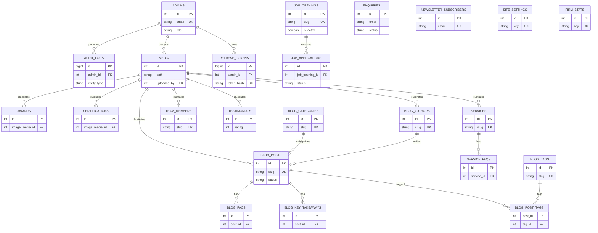

# Database Design Document
## Singh Amit & Associates — MySQL Schema (Public Site + Admin Panel)

| | |
|---|---|
| **Document Version** | 1.0 |
| **Engine** | InnoDB |
| **Character Set / Collation** | `utf8mb4` / `utf8mb4_unicode_ci` (every table, confirmed in migrations) |
| **ORM** | SQLAlchemy (Flask-SQLAlchemy 3.1.1) |
| **Migration Tool** | Alembic (Flask-Migrate 4.1.0) |
| **Status of Schema** | **21 of 21 tables below are LIVE** — created by migration `121d214ed04f_initial_schema` and amended by `c80f3e05d40c_rename_contact_and_career_fields`, confirmed by direct inspection of `backend/app/models/` and `backend/migrations/versions/`. **1 table (`refresh_tokens`) is NEW — required for the Admin Panel and not yet migrated.** |

This document supersedes the schema sketch in the audit report (`SAA-Architecture-Analysis.pdf`, Part 06) wherever the two differ — the audit was written before the backend existed; the tables below reflect the schema **as actually implemented and migrated**, which in every case matured beyond the audit's original sketch (real enum names, real check constraints, real `sort_order`/`is_active` conventions, media as a proper FK'd entity rather than a flat path column).

---

## 1. Conventions Applied Across All Tables

- Every table uses an auto-incrementing `id INT PRIMARY KEY` (except `audit_logs`, which uses `BIGINT` in anticipation of high write volume, and the `blog_post_tags` join table, which uses a composite PK).
- Every table with editorial content carries `created_at` / `updated_at` (`DATETIME(timezone=True)`, defaulting to UTC now, `updated_at` auto-updated) via the shared `TimestampMixin` (`backend/app/models/mixins.py`).
- Soft-delete pattern: content tables use `is_active BOOLEAN` rather than a hard delete, indexed for fast public-facing filtering (`WHERE is_active = 1`).
- Ordering pattern: display-order-sensitive tables carry `sort_order INT`.
- Media is centralized: any table needing an image references `media.id` via a nullable FK with `ON DELETE SET NULL` (never a raw file path column) — this is a meaningful improvement over the audit's original sketch, which had ad hoc `*_path` string columns everywhere.
- All foreign keys to soft-delete-relevant parents use `ON DELETE SET NULL` (preserve the child record) or `ON DELETE CASCADE` (true parent/child ownership, e.g. `blog_faqs` → `blog_posts`), chosen per relationship — see each table's Relationships section.

---

## 2. Table Catalogue

### 2.1 `admins`
**Purpose:** Admin Panel user accounts (both `admin` and `editor` roles). Backs FR-01–FR-05 in the SRS.

| Column | Type | Nullable | Default | Notes |
|---|---|---|---|---|
| id | INT | No | auto_increment | PK |
| name | VARCHAR(120) | No | — | |
| email | VARCHAR(190) | No | — | UNIQUE, indexed |
| password_hash | VARCHAR(255) | No | — | argon2id hash |
| role | ENUM('admin','editor') | No | — | named `admin_role` |
| is_active | BOOLEAN | No | true | disable account without deleting |
| last_login_at | DATETIME(tz) | Yes | NULL | |
| created_at / updated_at | DATETIME(tz) | No | now() | |

**Indexes:** `ix_admins_email` (UNIQUE). **PK:** `id`. **FK:** none outbound. **Inbound FK:** `audit_logs.admin_id`, `media.uploaded_by`.
**Relationships:** One admin → many `audit_logs`, many `media` uploads.
**Triggers:** None required; `last_login_at` is set by the auth service on successful login, not a DB trigger.
**Future columns:** `mfa_secret` (if 2FA is adopted per Document 1 §14 Future Enhancements); `invited_by` FK to support invite-based admin creation (Document 9's Admin Users module).
**Migration notes:** Live. No pending changes.
**Normalization review:** 3NF — no derived/duplicated data.
**Optimization suggestions:** None needed at current/expected scale (single-digit admin accounts). Add a composite index on `(email, is_active)` only if login volume ever grows enough to matter — not warranted today.

---

### 2.2 `refresh_tokens` — **NEW TABLE REQUIRED FOR ADMIN PANEL**
**Purpose:** Server-side revocable storage for JWT refresh tokens, enabling logout-everywhere, rotation, and audit of active sessions — required by SRS FR-02/FR-05 and the audit's Part 8 authentication architecture. This table **does not exist yet** and must be added via a new Alembic migration before `/api/auth/*` is implemented.

| Column | Type | Nullable | Default | Notes |
|---|---|---|---|---|
| id | BIGINT | No | auto_increment | PK |
| admin_id | INT | No | — | FK → `admins.id`, `ON DELETE CASCADE` |
| token_hash | VARCHAR(255) | No | — | SHA-256 hash of the refresh token; the raw token is never stored |
| issued_at | DATETIME(tz) | No | now() | |
| expires_at | DATETIME(tz) | No | — | `issued_at` + `JWT_REFRESH_DAYS` (env-configured) |
| revoked_at | DATETIME(tz) | Yes | NULL | set on logout or rotation |
| replaced_by_id | BIGINT | Yes | NULL | self-referencing FK, links a rotated token to its successor |
| user_agent | VARCHAR(255) | Yes | NULL | |
| ip_address | VARCHAR(45) | Yes | NULL | IPv6-safe length, matching `enquiries.ip_address` convention |

**Indexes:** `ix_refresh_tokens_admin_id`, `ix_refresh_tokens_token_hash` (UNIQUE), `ix_refresh_tokens_expires_at`.
**PK:** `id`. **FK:** `admin_id` → `admins.id` (CASCADE); `replaced_by_id` → `refresh_tokens.id` (SET NULL).
**Relationships:** One admin → many refresh tokens (session history); self-referencing rotation chain.
**Triggers:** None; expiry is enforced at the application layer on each refresh attempt, plus a periodic cleanup job (see Document 3 — Backup/Maintenance Strategy) that purges rows where `expires_at < now() - 30 days`.
**Future columns:** None anticipated.
**Migration notes:** **To be created** as the first migration of the Admin Panel build phase (Document 11, Phase 1). Must ship alongside the `/api/auth/*` implementation.
**Normalization review:** 3NF.
**Optimization suggestions:** Index `token_hash` as UNIQUE (already specified) since every refresh request looks it up by hash; run the cleanup job off-peak to avoid lock contention on a busy table.

---

### 2.3 `audit_logs`
**Purpose:** Immutable record of every admin action, backing SRS FR-12/FR-13 and Document 1 BR-06.

| Column | Type | Nullable | Default | Notes |
|---|---|---|---|---|
| id | BIGINT | No | auto_increment | PK — BIGINT chosen up front for high write volume |
| admin_id | INT | Yes | NULL | FK → `admins.id`, `ON DELETE SET NULL` (preserve log even if admin is later removed) |
| action | VARCHAR(80) | No | — | e.g. `create`, `update`, `delete`, `publish`, `status_change`, `login`, `logout` |
| entity_type | VARCHAR(80) | No | — | e.g. `blog_post`, `enquiry`, `team_member` |
| entity_id | INT | Yes | NULL | NULL for actions with no single entity (e.g. `login`) |
| details | JSON | Yes | NULL | before/after diff or free-form context |
| ip_address | VARCHAR(45) | Yes | NULL | |
| created_at | DATETIME(tz) | No | now() | |

**Indexes:** `ix_audit_logs_admin_id`, `ix_audit_logs_created_at`, `ix_audit_logs_entity_type`.
**PK:** `id`. **FK:** `admin_id` → `admins.id` (SET NULL).
**Relationships:** Many logs → one admin (nullable). No relationship to the entity tables themselves (intentionally denormalized via `entity_type`/`entity_id` rather than 20 nullable FK columns — this is the correct design choice for a generic audit trail; see Normalization review).
**Triggers:** None; every write goes through an application-layer audit-logging service call wrapping each admin mutation (see Document 3 — Logging Flow), not a DB trigger, so that the same write also has access to the authenticated admin's identity and IP from the request context.
**Future columns:** `request_id` (for tracing a log entry back to a specific API call in structured logs).
**Migration notes:** Live.
**Normalization review:** Deliberately denormalized (`entity_type`/`entity_id` instead of per-entity FK columns) — this is the standard, correct pattern for a polymorphic audit log and should not be "fixed" into 3NF; a fully normalized design would require 20+ nullable FK columns or a join table per entity type, which is worse in every practical dimension (write complexity, query complexity, schema churn every time a new module is added).
**Optimization suggestions:** Table will grow unbounded; plan a retention/archival policy (e.g., partition by month, or archive rows older than 24 months to cold storage) once volume materializes — not urgent at launch but should be a documented operational task in Document 3 (Backup Strategy).

---

### 2.4 `enquiries`
**Purpose:** Contact-form submissions. **Live and actively receiving public traffic** via `POST /api/enquiries`.

| Column | Type | Nullable | Default | Notes |
|---|---|---|---|---|
| id | INT | No | auto_increment | PK |
| name | VARCHAR(120) | No | — | |
| email | VARCHAR(190) | No | — | indexed, not unique (same person may enquire twice) |
| phone | VARCHAR(10) | No | — | renamed from `mobile` in migration `c80f3e05d40c` |
| service | VARCHAR(200) | Yes | NULL | renamed from `subject`; holds the selected service or the free-text "Other" value |
| message | TEXT | No | — | |
| status | ENUM('new','in_progress','resolved') | No | 'new' | named `enquiry_status` |
| ip_address | VARCHAR(45) | Yes | NULL | abuse tracking |
| user_agent | VARCHAR(255) | Yes | NULL | |
| created_at / updated_at | DATETIME(tz) | No | now() | |

**Indexes:** `ix_enquiries_email`, `ix_enquiries_status`. **PK:** `id`. **FK:** none.
**Relationships:** Standalone (no incoming/outgoing FK) — matches the audit's original design intent that lead-capture tables are independent content domains.
**Triggers:** None.
**Future columns:** `source_page` (which route the enquiry was submitted from — present in the audit's original sketch but not yet implemented; useful for marketing attribution, low priority).
**Migration notes:** Live; field-renamed once already (`mobile`→`phone`, `subject`→`service`) to match the frontend's actual payload — a real example of iterative schema evolution, not a one-shot design.
**Normalization review:** 3NF.
**Optimization suggestions:** Add a composite index on `(status, created_at)` once the Admin Panel's Enquiries list view is built, to serve the default "newest unresolved first" sort efficiently — not yet needed at current low volume but cheap to add proactively during the Admin Panel migration.

---

### 2.5 `job_openings`
**Purpose:** Recruitment listings shown on `/career` and manageable in the Admin Panel.

| Column | Type | Nullable | Default | Notes |
|---|---|---|---|---|
| id | INT | No | auto_increment | PK |
| title | VARCHAR(160) | No | — | |
| slug | VARCHAR(180) | No | — | UNIQUE |
| department | VARCHAR(120) | Yes | NULL | |
| location | VARCHAR(120) | Yes | NULL | |
| employment_type | ENUM('full_time','part_time','internship','contract') | No | — | |
| description | TEXT | No | — | |
| requirements | TEXT | Yes | NULL | |
| responsibilities | TEXT | Yes | NULL | |
| min_experience_years | INT | Yes | NULL | |
| is_active | BOOLEAN | No | true | soft delete / unpublish |
| posted_at | DATETIME(tz) | No | now() | |
| closes_at | DATETIME(tz) | Yes | NULL | |
| created_at / updated_at | DATETIME(tz) | No | now() | |

**Indexes:** `ix_job_openings_slug` (UNIQUE), `ix_job_openings_is_active`. **PK:** `id`. **FK:** none outbound; inbound from `job_applications.job_opening_id`.
**Relationships:** One opening → many applications.
**Triggers:** None.
**Future columns:** `salary_range_min`/`max` (not currently displayed anywhere on the public site — do not add speculatively; only if a future requirement confirms it).
**Migration notes:** Live.
**Normalization review:** 3NF.
**Optimization suggestions:** None required at current scale (5 listed openings per the audit).

---

### 2.6 `job_applications`
**Purpose:** Career-page submissions including résumé upload. **Live**, confirmed by inspection to have processed at least one real multipart submission end-to-end.

| Column | Type | Nullable | Default | Notes |
|---|---|---|---|---|
| id | INT | No | auto_increment | PK |
| job_opening_id | INT | Yes | NULL | FK → `job_openings.id`, `ON DELETE SET NULL` |
| name | VARCHAR(120) | No | — | |
| email | VARCHAR(190) | No | — | indexed |
| phone | VARCHAR(10) | No | — | renamed from `mobile` |
| position_applied_for | VARCHAR(160) | Yes | NULL | snapshot of the title at time of application, survives opening deletion |
| message | TEXT | Yes | NULL | renamed from `cover_letter` |
| experience | VARCHAR(60) | Yes | NULL | added in migration `c80f3e05d40c` |
| resume_filename | VARCHAR(255) | No | — | original filename, display only |
| resume_path | VARCHAR(500) | No | — | randomized on-disk/storage path, never guessable |
| resume_mime_type | VARCHAR(100) | No | — | content-sniffed via `python-magic`, not trusted from the client |
| resume_size_bytes | INT | No | — | |
| status | ENUM('new','reviewed','shortlisted','rejected','hired') | No | 'new' | |
| ip_address | VARCHAR(45) | Yes | NULL | |
| created_at / updated_at | DATETIME(tz) | No | now() | |

**Indexes:** `ix_job_applications_email`, `ix_job_applications_job_opening_id`, `ix_job_applications_status`. **PK:** `id`. **FK:** `job_opening_id` → `job_openings.id` (SET NULL).
**Relationships:** Many applications → one (optional) opening.
**Triggers:** None; résumé file lifecycle (creation, and eventual deletion per Document 1 Assumption A-05's retention policy) is application-layer, via `storage_service.py`.
**Future columns:** `resume_media_id` (migrating résumés into the unified `media` table is a candidate simplification, but résumés are access-controlled differently from public media and are deliberately kept separate today — do not merge without re-confirming the access-control implications).
**Migration notes:** Live; `mobile`→`phone`, `cover_letter`→`message` renamed and `experience` added in the second migration.
**Normalization review:** 3NF. `position_applied_for` is an intentional denormalized snapshot (not a normalization defect) — it preserves what the applicant actually applied for even if the opening is later retitled or deleted.
**Optimization suggestions:** Composite index `(status, created_at)` for the Admin Panel's default triage view, same rationale as `enquiries`.

---

### 2.7 `newsletter_subscribers`
**Purpose:** Blog newsletter signups. **Live** via `POST /api/newsletter/subscribe`.

| Column | Type | Nullable | Default | Notes |
|---|---|---|---|---|
| id | INT | No | auto_increment | PK |
| email | VARCHAR(190) | No | — | UNIQUE |
| status | ENUM('subscribed','unsubscribed') | No | 'subscribed' | |
| ip_address | VARCHAR(45) | Yes | NULL | |
| subscribed_at | DATETIME(tz) | No | now() | |
| unsubscribed_at | DATETIME(tz) | Yes | NULL | |

**Indexes:** `ix_newsletter_subscribers_email` (UNIQUE). **PK:** `id`. **FK:** none.
**Relationships:** Standalone.
**Triggers:** None; idempotent-subscribe logic (already implemented) checks for an existing row before insert.
**Future columns:** `confirmed_at` (if double opt-in is implemented per the audit's Part 5 recommendation — not yet built).
**Migration notes:** Live.
**Normalization review:** 3NF.
**Optimization suggestions:** None needed.

---

### 2.8 `media`
**Purpose:** Centralized file registry backing the Admin Panel's Media Library (SRS FR-07). Table exists and is migrated; **currently unused in practice** — nothing writes to it outside the seed script, since no upload UI exists yet.

| Column | Type | Nullable | Default | Notes |
|---|---|---|---|---|
| id | INT | No | auto_increment | PK |
| filename | VARCHAR(255) | No | — | stored (randomized) filename |
| original_filename | VARCHAR(255) | No | — | for display/download |
| path | VARCHAR(500) | No | — | storage-backend-relative path (local disk today; S3 key once implemented) |
| mime_type | VARCHAR(100) | No | — | content-sniffed |
| size_bytes | INT | No | — | |
| alt_text | VARCHAR(255) | Yes | NULL | accessibility |
| uploaded_by | INT | Yes | NULL | FK → `admins.id`, `ON DELETE SET NULL` |
| created_at | DATETIME(tz) | No | now() | |

**Indexes:** none beyond PK today; **recommend adding** `ix_media_uploaded_by` once the Media Library ships and admin-scoped filtering is needed.
**PK:** `id`. **FK:** `uploaded_by` → `admins.id` (SET NULL).
**Relationships:** Referenced by `awards.image_media_id`, `certifications.image_media_id`, `services.featured_image_media_id`, `team_members.photo_media_id`, `testimonials.photo_media_id`, `blog_authors.avatar_media_id`, `blog_posts.featured_image_media_id` — a genuinely hub-and-spoke design, all `ON DELETE SET NULL` so deleting a media asset never cascades into deleting unrelated content, only clears its image reference.
**Triggers:** None.
**Future columns:** `width`/`height` (for responsive `srcset` generation, ties into the audit's Performance Review image-optimization recommendation), `variant_of_media_id` (if generated thumbnails/WebP variants are stored as separate rows).
**Migration notes:** Live but empty in production use.
**Normalization review:** 3NF — this is the schema's strongest normalization win versus the audit's original sketch (which had `*_path` string duplicated per table).
**Optimization suggestions:** Add `updated_at` (currently missing — `alt_text` edits won't be timestamped without it) as a small follow-up migration; add the `uploaded_by` index before the Media Library ships.

---

### 2.9 `site_settings`
**Purpose:** Generic key-value store for firm contact details, social links, SEO defaults — resolves the audit's recommendation for an admin-editable settings table.

| Column | Type | Nullable | Default | Notes |
|---|---|---|---|---|
| id | INT | No | auto_increment | PK |
| key | VARCHAR(120) | No | — | UNIQUE |
| value | TEXT | Yes | NULL | |
| value_type | ENUM('string','number','boolean','json') | No | — | tells the frontend/admin how to parse `value` |
| updated_at | DATETIME(tz) | No | now() | |

**Indexes:** `ix_site_settings_key` (UNIQUE). **PK:** `id`. **FK:** none.
**Relationships:** Standalone, single-record-per-key.
**Triggers:** None.
**Future columns:** `updated_by` FK → `admins.id` (useful pairing with `audit_logs`, currently the audit trail alone covers this but a direct column would simplify "who changed this setting last" without a join).
**Migration notes:** Live but has no `created_at` column — acceptable since settings are typically pre-seeded (upsert semantics), not "created" in the editorial sense, but flag as a minor inconsistency versus every other table's timestamp convention.
**Normalization review:** EAV-style (Entity-Attribute-Value) by design — correct choice for a small, heterogeneous settings bag; would be over-engineering to give every setting its own column.
**Optimization suggestions:** None; table will always be small (dozens of rows).

---

### 2.10 `firm_stats`
**Purpose:** The single source of truth for firm statistics ("years of experience," "clients served," etc.) — **directly resolves the audit's flagged content-consistency defect** (three conflicting "years of experience" numbers across the live site).

| Column | Type | Nullable | Default | Notes |
|---|---|---|---|---|
| id | INT | No | auto_increment | PK |
| key | VARCHAR(80) | No | — | UNIQUE, e.g. `years_experience` |
| label | VARCHAR(160) | No | — | display label |
| value | VARCHAR(40) | No | — | stored as string to allow non-numeric display values (e.g. "25") |
| suffix | VARCHAR(20) | Yes | NULL | e.g. "+" |
| icon | VARCHAR(80) | Yes | NULL | |
| sort_order | INT | No | — | |
| is_active | BOOLEAN | No | true | |
| created_at / updated_at | DATETIME(tz) | No | now() | |

**Indexes:** `ix_firm_stats_key` (UNIQUE), `ix_firm_stats_is_active`. **PK:** `id`. **FK:** none.
**Relationships:** Standalone.
**Triggers:** None.
**Future columns:** None anticipated.
**Migration notes:** Live.
**Normalization review:** 3NF.
**Optimization suggestions:** None; table is intentionally tiny.

---

### 2.11 `awards`
**Purpose:** Firm awards/recognitions timeline on `/about`.

| Column | Type | Nullable | Default | Notes |
|---|---|---|---|---|
| id | INT | No | auto_increment | PK |
| title | VARCHAR(200) | No | — | |
| description | TEXT | Yes | NULL | |
| year | SMALLINT | Yes | NULL | |
| image_media_id | INT | Yes | NULL | FK → `media.id`, SET NULL |
| sort_order | INT | No | — | |
| is_active | BOOLEAN | No | true | |
| created_at / updated_at | DATETIME(tz) | No | now() | |

**Indexes:** `ix_awards_is_active`. **PK:** `id`. **FK:** `image_media_id` → `media.id` (SET NULL).
**Relationships:** Many-to-one to `media` (optional image).
**Triggers:** None. **Future columns:** `organization` (issuing body — present in the audit's sketch, not yet in the live schema; low-priority addition). **Migration notes:** Live. **Normalization review:** 3NF. **Optimization suggestions:** None.

---

### 2.12 `certifications`
**Purpose:** ICAI/ISO/Udyam-style certification badges on `/about`.

| Column | Type | Nullable | Default | Notes |
|---|---|---|---|---|
| id | INT | No | auto_increment | PK |
| name | VARCHAR(200) | No | — | |
| description | TEXT | Yes | NULL | |
| issuing_body | VARCHAR(200) | Yes | NULL | |
| image_media_id | INT | Yes | NULL | FK → `media.id`, SET NULL |
| sort_order | INT | No | — | |
| is_active | BOOLEAN | No | true | |
| created_at / updated_at | DATETIME(tz) | No | now() | |

**Indexes:** `ix_certifications_is_active`. **PK:** `id`. **FK:** `image_media_id` → `media.id` (SET NULL).
**Relationships:** Many-to-one to `media`.
**Triggers:** None. **Future columns:** None. **Migration notes:** Live. **Normalization review:** 3NF. **Optimization suggestions:** None.

---

### 2.13 `services`
**Purpose:** The four (extendable) service lines (GST, Income Tax, TDS, Accounting & Bookkeeping) as admin-manageable records, addressing the audit's finding that these are currently four independently-coded pages.

| Column | Type | Nullable | Default | Notes |
|---|---|---|---|---|
| id | INT | No | auto_increment | PK |
| name | VARCHAR(160) | No | — | |
| slug | VARCHAR(180) | No | — | UNIQUE, matches the route (`gst-services`, etc.) |
| short_description | VARCHAR(500) | Yes | NULL | |
| full_description | TEXT | Yes | NULL | |
| icon | VARCHAR(80) | Yes | NULL | |
| featured_image_media_id | INT | Yes | NULL | FK → `media.id`, SET NULL |
| sort_order | INT | No | — | |
| is_active | BOOLEAN | No | true | |
| created_at / updated_at | DATETIME(tz) | No | now() | |

**Indexes:** `ix_services_slug` (UNIQUE), `ix_services_is_active`. **PK:** `id`. **FK:** `featured_image_media_id` → `media.id` (SET NULL).
**Relationships:** One service → many `service_faqs`.
**Triggers:** None.
**Future columns:** None planned — note that this table intentionally stores only the *editable metadata* of each service, not the rich, section-by-section page content (Compliance Matters, Filing Calendar, Industries, etc.) that the audit found hard-coded per service page; fully modeling those bespoke sections is a larger future initiative (see Document 1 §14) and is **not** committed Admin Panel scope.
**Migration notes:** Live.
**Normalization review:** 3NF.
**Optimization suggestions:** None.

---

### 2.14 `service_faqs`
**Purpose:** Per-service FAQ accordion content (child of `services`).

| Column | Type | Nullable | Default | Notes |
|---|---|---|---|---|
| id | INT | No | auto_increment | PK |
| service_id | INT | No | — | FK → `services.id`, `ON DELETE CASCADE` |
| question | VARCHAR(300) | No | — | |
| answer | TEXT | No | — | |
| sort_order | INT | No | — | |

**Indexes:** `ix_service_faqs_service_id`. **PK:** `id`. **FK:** `service_id` → `services.id` (CASCADE — FAQs have no meaning without their parent service).
**Relationships:** Many FAQs → one service.
**Triggers:** None. **Future columns:** None. **Migration notes:** Live. **Normalization review:** 3NF. **Optimization suggestions:** None.

---

### 2.15 `team_members`
**Purpose:** Partner/staff bios on `/about`.

| Column | Type | Nullable | Default | Notes |
|---|---|---|---|---|
| id | INT | No | auto_increment | PK |
| name | VARCHAR(120) | No | — | |
| slug | VARCHAR(140) | No | — | UNIQUE |
| designation | VARCHAR(160) | Yes | NULL | |
| bio | TEXT | Yes | NULL | |
| qualifications | VARCHAR(300) | Yes | NULL | free text, e.g. "FCA, DISA" |
| photo_media_id | INT | Yes | NULL | FK → `media.id`, SET NULL |
| email | VARCHAR(190) | Yes | NULL | |
| linkedin_url | VARCHAR(300) | Yes | NULL | |
| sort_order | INT | No | — | |
| is_active | BOOLEAN | No | true | soft delete when a partner leaves |
| created_at / updated_at | DATETIME(tz) | No | now() | |

**Indexes:** `ix_team_members_slug` (UNIQUE), `ix_team_members_is_active`. **PK:** `id`. **FK:** `photo_media_id` → `media.id` (SET NULL).
**Relationships:** Many-to-one to `media`.
**Triggers:** None. **Future columns:** `expertise` (JSON array of tags, present in the audit's original sketch, not yet in the live schema — candidate follow-up migration if the Admin Panel needs to reproduce the public site's "expertise" tags on partner cards). **Migration notes:** Live. **Normalization review:** 3NF (`qualifications` as free text rather than a normalized qualifications table is an appropriate simplification at this scale). **Optimization suggestions:** None.

---

### 2.16 `testimonials`
**Purpose:** Client testimonials/reviews shown on `/` and elsewhere.

| Column | Type | Nullable | Default | Notes |
|---|---|---|---|---|
| id | INT | No | auto_increment | PK |
| client_name | VARCHAR(120) | No | — | |
| client_designation | VARCHAR(160) | Yes | NULL | |
| client_company | VARCHAR(160) | Yes | NULL | |
| content | TEXT | No | — | |
| rating | SMALLINT | Yes | NULL | CHECK 1–5 |
| photo_media_id | INT | Yes | NULL | FK → `media.id`, SET NULL |
| is_featured | BOOLEAN | No | false | |
| is_active | BOOLEAN | No | true | |
| sort_order | INT | No | — | |
| created_at / updated_at | DATETIME(tz) | No | now() | |

**Indexes:** `ix_testimonials_is_active`, `ix_testimonials_is_featured`. **PK:** `id`. **FK:** `photo_media_id` → `media.id` (SET NULL).
**Constraints:** `CHECK (rating IS NULL OR (rating BETWEEN 1 AND 5))` — `ck_testimonial_rating_range`.
**Relationships:** Many-to-one to `media`.
**Triggers:** None. **Future columns:** None. **Migration notes:** Live. **Normalization review:** 3NF. **Optimization suggestions:** None.

---

### 2.17 `blog_categories`
**Purpose:** Blog taxonomy (10 categories per the audit).

| Column | Type | Nullable | Default | Notes |
|---|---|---|---|---|
| id | INT | No | auto_increment | PK |
| name | VARCHAR(120) | No | — | |
| slug | VARCHAR(140) | No | — | UNIQUE |
| description | TEXT | Yes | NULL | |
| created_at / updated_at | DATETIME(tz) | No | now() | |

**Indexes:** `ix_blog_categories_slug` (UNIQUE). **PK:** `id`. **FK:** none outbound; inbound from `blog_posts.category_id`.
**Relationships:** One category → many posts. **Triggers:** None. **Future columns:** None. **Migration notes:** Live. **Normalization review:** 3NF. **Optimization suggestions:** None.

---

### 2.18 `blog_tags`
**Purpose:** Blog tags (many-to-many with posts).

| Column | Type | Nullable | Default | Notes |
|---|---|---|---|---|
| id | INT | No | auto_increment | PK |
| name | VARCHAR(80) | No | — | |
| slug | VARCHAR(100) | No | — | UNIQUE |

**Indexes:** `ix_blog_tags_slug` (UNIQUE). **PK:** `id`. **Relationships:** Many-to-many with `blog_posts` via `blog_post_tags`. **Triggers:** None. **Future columns:** None. **Migration notes:** Live — note this table has no `created_at`/`updated_at`, an intentional minimalism for a pure lookup table. **Normalization review:** 3NF. **Optimization suggestions:** None.

---

### 2.19 `blog_authors`
**Purpose:** Blog post bylines.

| Column | Type | Nullable | Default | Notes |
|---|---|---|---|---|
| id | INT | No | auto_increment | PK |
| name | VARCHAR(120) | No | — | |
| slug | VARCHAR(140) | No | — | UNIQUE |
| designation | VARCHAR(160) | Yes | NULL | |
| bio | TEXT | Yes | NULL | |
| avatar_media_id | INT | Yes | NULL | FK → `media.id`, SET NULL |
| created_at / updated_at | DATETIME(tz) | No | now() | |

**Indexes:** `ix_blog_authors_slug` (UNIQUE). **PK:** `id`. **FK:** `avatar_media_id` → `media.id` (SET NULL). **Relationships:** One author → many posts. **Triggers:** None. **Future columns:** `linkedin_url`/`email` (present in the audit's original sketch, not yet in the live schema). **Migration notes:** Live. **Normalization review:** 3NF. **Optimization suggestions:** None.

---

### 2.20 `blog_posts`
**Purpose:** The core content entity — 28 posts today, migrating from `frontend/src/data/blog/posts.js`.

| Column | Type | Nullable | Default | Notes |
|---|---|---|---|---|
| id | INT | No | auto_increment | PK |
| title | VARCHAR(220) | No | — | |
| slug | VARCHAR(240) | No | — | UNIQUE |
| excerpt | VARCHAR(500) | Yes | NULL | |
| content | TEXT | No | — | rich-text/HTML body |
| featured_image_media_id | INT | Yes | NULL | FK → `media.id`, SET NULL |
| category_id | INT | Yes | NULL | FK → `blog_categories.id`, SET NULL |
| author_id | INT | Yes | NULL | FK → `blog_authors.id`, SET NULL |
| status | ENUM('draft','published','archived') | No | 'draft' | |
| published_at | DATETIME(tz) | Yes | NULL | |
| reading_time_minutes | INT | Yes | NULL | |
| views_count | INT | No | 0 | |
| meta_title | VARCHAR(220) | Yes | NULL | SEO |
| meta_description | VARCHAR(320) | Yes | NULL | SEO |
| created_at / updated_at | DATETIME(tz) | No | now() | |

**Indexes:** `ix_blog_posts_slug` (UNIQUE), `ix_blog_posts_status`, `ix_blog_posts_category_id`, `ix_blog_posts_author_id`, `ix_blog_posts_published_at`.
**PK:** `id`. **FK:** `featured_image_media_id`→`media.id` (SET NULL), `category_id`→`blog_categories.id` (SET NULL), `author_id`→`blog_authors.id` (SET NULL).
**Relationships:** One post → many `blog_faqs`, many `blog_key_takeaways`; many-to-many with `blog_tags` via `blog_post_tags`.
**Triggers:** None; `views_count` increment happens at the application layer on each `GET /api/blog/posts/:slug` request (already implemented), not a DB trigger, to avoid a write on every read without a queued/batched approach — flagged as a future optimization below.
**Future columns:** `content_format` (if migrating away from the current hand-rolled lightweight markdown-like parser noted in the audit toward a stored rich-text/HTML format from an admin WYSIWYG editor — see Document 6, Rich Text Editor component).
**Migration notes:** Live; empty of the 28 real posts today (only present via the seed script / `scripts/frontend_data.snapshot.json`, not yet migrated into rows — **flag: confirm whether `seed_data.py` has actually been run against the target environment before assuming the 28 posts are live in the DB**, this is a deployment-step detail, not a schema detail).
**Normalization review:** 3NF.
**Optimization suggestions:** `views_count` increments on every read are a write-amplification risk at scale; consider batching via a queue or a periodic aggregate job once traffic volume justifies it — not needed at current scale (28 posts, marketing-site traffic levels).

---

### 2.21 `blog_post_tags`
**Purpose:** Many-to-many join between `blog_posts` and `blog_tags`.

| Column | Type | Nullable | Notes |
|---|---|---|---|
| post_id | INT | No | FK → `blog_posts.id`, CASCADE |
| tag_id | INT | No | FK → `blog_tags.id`, CASCADE |

**PK:** composite `(post_id, tag_id)`. **Indexes:** covered by the composite PK. **Relationships:** pure join table. **Triggers:** None. **Future columns:** None — a join table should stay minimal. **Migration notes:** Live. **Normalization review:** Textbook 3NF/BCNF many-to-many resolution. **Optimization suggestions:** None.

---

### 2.22 `blog_key_takeaways`
**Purpose:** "Key Takeaways" bullet list on each blog post (child of `blog_posts`).

| Column | Type | Nullable | Notes |
|---|---|---|---|
| id | INT | No | PK |
| post_id | INT | No | FK → `blog_posts.id`, CASCADE |
| content | VARCHAR(500) | No | |
| sort_order | INT | No | |

**Indexes:** `ix_blog_key_takeaways_post_id`. **Relationships:** Many → one post. **Triggers:** None. **Future columns:** None. **Migration notes:** Live. **Normalization review:** 3NF. **Optimization suggestions:** None.

---

### 2.23 `blog_faqs`
**Purpose:** Per-post FAQ accordion content (child of `blog_posts`).

| Column | Type | Nullable | Notes |
|---|---|---|---|
| id | INT | No | PK |
| post_id | INT | No | FK → `blog_posts.id`, CASCADE |
| question | VARCHAR(300) | No | |
| answer | TEXT | No | |
| sort_order | INT | No | |

**Indexes:** `ix_blog_faqs_post_id`. **Relationships:** Many → one post. **Triggers:** None. **Future columns:** None. **Migration notes:** Live. **Normalization review:** 3NF. **Optimization suggestions:** None.

---

## 3. Table Inventory Summary

| # | Table | Domain | Status |
|---|---|---|---|
| 1 | admins | Auth | Live |
| 2 | **refresh_tokens** | Auth | **NEW — required for Admin Panel** |
| 3 | audit_logs | Governance | Live (empty until admin mutations exist) |
| 4 | enquiries | Lead capture | Live, receiving public traffic |
| 5 | job_openings | Careers | Live |
| 6 | job_applications | Careers | Live, receiving public traffic |
| 7 | newsletter_subscribers | Lead capture | Live, receiving public traffic |
| 8 | media | Media | Live, unused (no upload UI yet) |
| 9 | site_settings | Settings | Live |
| 10 | firm_stats | Firm content | Live |
| 11 | awards | Firm content | Live |
| 12 | certifications | Firm content | Live |
| 13 | services | Firm content | Live |
| 14 | service_faqs | Firm content | Live |
| 15 | team_members | Firm content | Live |
| 16 | testimonials | Firm content | Live |
| 17 | blog_categories | Blog | Live |
| 18 | blog_tags | Blog | Live |
| 19 | blog_authors | Blog | Live |
| 20 | blog_posts | Blog | Live |
| 21 | blog_post_tags | Blog | Live |
| 22 | blog_key_takeaways | Blog | Live |
| 23 | blog_faqs | Blog | Live |

**22 live tables + 1 new table = 23 total** — the live count is one higher than the audit's original 22-table estimate because the live schema splits `media` out as its own hub table (an improvement the audit anticipated only informally) while otherwise tracking the plan closely.

---

## 4. Entity-Relationship Diagram

`enquiries`, `newsletter_subscribers`, `site_settings`, and `firm_stats` are intentionally standalone (no FK edges) — same rationale the audit gave: independent content domains with no natural parent/child relationship to the blog, media, or careers clusters.

---

## 5. Normalization Review (Schema-Wide)

The schema is in **Third Normal Form (3NF)** throughout, with two deliberate, justified exceptions:
1. `audit_logs` uses a polymorphic `entity_type`/`entity_id` pair instead of per-entity foreign keys — correct for a generic audit trail (see §2.3).
2. `site_settings` uses an EAV key-value pattern — correct for a small, heterogeneous configuration bag (see §2.9).

No transitive dependencies, no repeating groups, and no update anomalies were found in any of the content tables. The `media` hub-and-spoke design (§2.8) is a specific normalization *improvement* over the audit's original flat-path sketch, eliminating what would otherwise have been duplicated file-metadata columns across seven tables.

## 6. Schema-Wide Optimization Suggestions

1. Add `ix_media_uploaded_by` and a `media.updated_at` column before the Media Library ships (§2.8).
2. Add composite `(status, created_at)` indexes to `enquiries` and `job_applications` to serve the Admin Panel's default triage sort efficiently (§2.4, §2.6).
3. Plan an `audit_logs` retention/archival policy ahead of volume growth (§2.3).
4. Confirm `blog_posts.views_count` write pattern before traffic scales meaningfully beyond current levels (§2.20).
5. Create the `refresh_tokens` migration and its cleanup job as the first piece of Admin Panel backend work (§2.2), since every other Admin Panel endpoint depends on authentication.

## 7. Migration Governance

- All schema changes go through Alembic (`flask db migrate` / `flask db upgrade`), never manual `ALTER TABLE` against any environment.
- Every migration must be reversible (a working `downgrade()`), consistent with the two existing migrations.
- Migrations are environment-agnostic (dev/staging/production run the identical migration chain) — no environment-specific schema drift is permitted.
- Any future migration that renames or drops a column already consumed by the live frontend (`frontend/src/api/*`) must ship in lockstep with the corresponding frontend change, exactly as `c80f3e05d40c` did for `mobile→phone`/`subject→service`/`cover_letter→message`.
